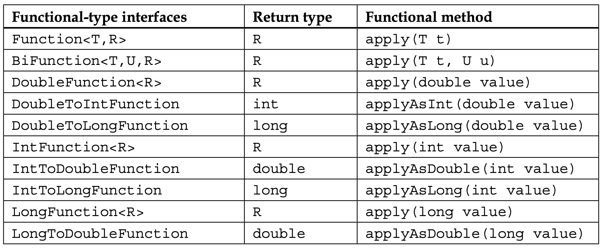
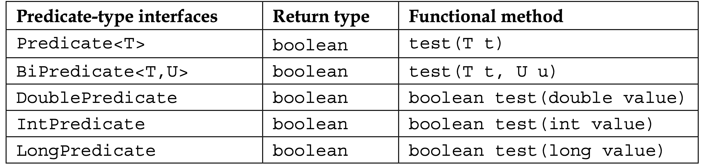
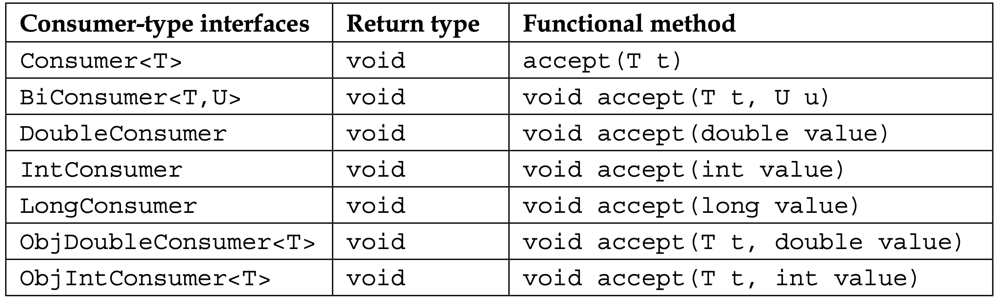
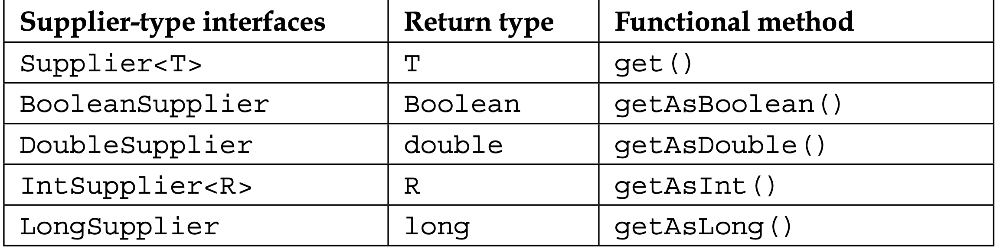
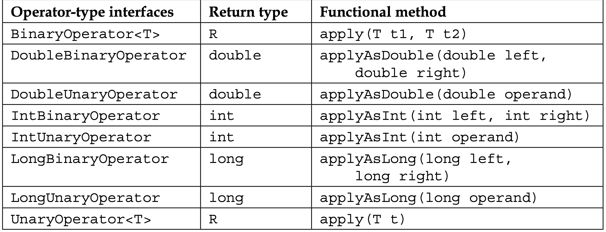

# **`Functions in Functional Programming`**


- [Lambda Expression](#lambda-express)
- [Common functional interfaces](#common-functional-interfaces)

	- [Function Type](#function-type)
	- [Predicate Type](#predicate-type)
	- [Consumer Type](#consumer-type)

- [Functional interfaces](#functional-interfaces)
- [Java 8 type inference](#java-8-type-inference)
- [Higher Order Functions](#higher-order-functions)

  - [Returning a function](#returning-a-function)

- [First-class functions](#first-class-functions)
- [The Pure function](#the-pure-function)
- [Closure in Java](#closure-in-java)
- [Currying](#currying)
---

---

## **`Lambda Expression`**

The simplest form of the function
```java
 x -> x + 1;
```

The parameter(s) can be enclosed in parentheses

```java
(x) -> x + 10;
```

A data type can be declared for parameter(s)
```java
(Integer x)-> x + 100;
```

A multiline function which is verbose

```java
x -> {
	x + 1;
	return x;
}
```

A multiline function which uses a local variable

```java
x ->{

	Integer y;
	y = x + 1;
	return y;
}
```

Multiple parameters must be placed in parentheses
```java
(x,y) -> x + y
```
Data types can be declared.
```java
(Integer x, Integer y) -> x+ y
```

The parameter's data types can be different
```java
(Integer x, Double y) -> x+ y
```

A return value is not required
```java
(x,y) -> System.out.println(x+y)
```

## **`Java 8 type inference`**


```java
interface Concatenation<T>{
	public String concatenate(T u,T v);
}
```
-  The data type of the lambda expression's parameters are not specified, 
- the system can infer that they be treated as either an Integer or a String types.
```java
Concatenation<String> string=(a,b)-> a +" : " + b;
	
Concatenation<Integer> integer = (a,b)->a + " : " +b;

System.out.println(string.concatenate("Cat", "Dog"));
System.out.println(integer.concatenate(100, 200));
	
```

When a lambda expression is assigned to a variable, the left-hand side of the assignment is called the lambda expression's target type.

```java
Function<String> myFunction;
```

- There are several rules for target types:
	- It must be a functional interface
	- It must be compatible with the abstract method's parameter and return types
	- It must throw only those exceptions thrown by the abstract method

---
## **`Functional interfaces`**
A functional interface is an interface that has one and only one abstract method.

```java
@FunctionalInterface
public interface IntegerConcatenation {
    public String concatenate(Integer n1, Integer n2);
}
```
- Note the use of the `@FunctionalInterface` annotation. While not required, it will generate a syntax error if the interface is not a functional interface.

---

## **`Common functional interfaces`**


These interfaces into five categories:

- `Function`: 
	- These transform their arguments and return a value
- `Predicate`: 
	- These are used to perform a test, which returns a Boolean value.
- `Consumer`: 
	- These use their arguments, but do not return a value
- `Supplier`: 
	- These are not passed data, but do return data
- `Operator`: 
	- These perform a reduction type operation

---

## **`Function Type`**
Its abstract method is called apply.

It performs a `transformation` type operation against its arguments.

- Its signature is as follows:

```java
R apply(T)
```

```java
Function<Integer, Double> half = a -> a / 2.0;

// Applying the function to get the result
System.out.println(half.apply(10));
```
There are several other interfaces related to the Function interface that accept one
or two arguments and return a single value.




## **`Predicate Type`**

Where a test needs to be performed and a Boolean value needs to be returned.
```java
boolean test(T t)
```

```java
Predicate<Integer> tooLarge = s -> s>100;
System.out.println(tooLarge.test(45));
```

```java
List<Integer> list = Arrays.asList(230, 45, 13, 563, 4);
 Stream<Integer> stream = list.stream();
 stream.forEach(s->System.out.println(tooLarge.test(s)));
```

There are six predicate-type functional interfaces. 




## **`Consumer Type`**

The consumer-type functional interface  accepts input, but not return a value.
 
It consumes its input. It is typified by the Consumer interface whose accept method's signature is shown here:

```java
void accept(T t)
```

Example

```java
       list.forEach(s ->System.out.println(
           processString(t->t.toLowerCase(), s)));
```


There are seven functional style interfaces all of which return void. They differ in terms of the number and types of parameters. These are listed next:




---

## **`Supplier Type`**

The supplier-type functional interfaces are intended to return a data type, but no input is provided.

It is like a source of information. The Supplier interface typifies this style and its get method's signature is as follows:

```java
T get()
```

Example

```java
String data= "Java 8 functional interface";
Supplier<Boolean> boolSupplier= ()->data.length()==10;
Supplier<Integer> intSupplier = ()->data.length() - 2;
Supplier<String> stringSupplier = ()->data.toLowerCase();


System.out.println(intSupplier.get());
System.out.println(boolSupplier.get());
System.out.println(stringSupplier.get());
		
```



## **`Operator Type`** 

The operator-type functional interfaces are used to apply some operation against one or two operands.

It corresponds to unary or binary type operators.

The BinaryOperator interface typifies the operator type.

Its apply method's signature is as follows:

```java
R apply(T t1, T t2)
```




---

## **`Higher Order Functions`**

A Higher order function takes a function as argument or returns a function as a value.

### **`Example`**

**`The higher-order function using an imperative.`**

```java
List<String> names = Arrays.asList("Aung Aung","Naw Naw","Aung La");
for (String s : names) {
	System.out.println(s.toLowerCase());
}
```

**`The higher-order function using a functional approach.`**

- create a method

```java
public  String processString(
    Function<String, String> operation,String target) {
    return operation.apply(target);
}
```

```java
names.forEach(
    s->System.out.println(
    processString(t->t.toLowerCase(), s)
));
```

**`Method References`**

```java
names.forEach(
    s->System.out.println(
	processString(String::toLowerCase, s)
));
```

### Why functional

- flexible
- reusable

Example to perform upperCase

```java
names.forEach(
    s->System.out.println(
    processString(t->t.toUpperCase(), s)
));
```

## More Example

```java
List<String> numString = Arrays.asList("10","20","30","40","50");
List<Integer> numbers = new ArrayList<Integer>();
Function<List<String>, List<Integer>> numFunction = s->{
	s.stream()
	.forEach(
		n->numbers.add(Integer.valueOf(n))
	);
	return numbers;
};
System.out.println(numFunction.apply(numString));
```

### **The real power comes passing these functions to other function.**

```java
Arrays.asList(numString)
    .stream()
    .map(numFunction)
    .forEach(s->System.out.println(s));
```

---

## **`Returning a function`**

- When a value is returned from a function or method, it is intended to be used elsewhere in the application.
- Sometimes, the return value is used to determine how subsequent computations should proceed.

### employee type

```java
enum EMPLOYEE_TYPE {
	Hourly,
	Salary,
	Sales
}
```

### functional method that return by

```java
public  static BiFunction<Integer, Float, Float> calculatePay(EMPLOYEE_TYPE emType){
	switch (emType) {
	case Hourly :return (hour,payRate) -> hour * payRate;
	case Salary : return (hour,payRate)->40 * payRate;
	case Sales:return (hour,payRate)-> 500f * 0.15f * payRate;
	default:
		return null;
	}
	}
```

### It can be invoked as :

```java
int [] hoursOfWorks = {8,12,8,6,6,5,6,0};
    int totalHoursOfWorks= Arrays.stream(hoursOfWorks).sum();
    var result= EmployeeService.calculatePay(EMPLOYEE_TYPE.Salary)
    		.apply(totalHoursOfWorks, 15.0f);
    System.out.println(result);
```

---

## **`First-class functions`**

- Assign a function to a variable (lambda expression).

```java
Function<String,String> toLowerFunction= t -> t.toLowerCase();
```

- Assign a lambda expression to this variable.

```java
Consumer<String> consumer;
consumer = s -> System.out.println(toLowerFunction.apply(s));
```

- use the `consumer` variable as the argument of the forEach method:

```java
list.forEach(consumer);
```

---

## **`The Pure function`**

- A function that has no side effects.
  - the function does not modify nonlocal variables and does not perform I/O.

A pure function with no side effects

```java
public class SimpleMath {
    public static int square(int x) {
		return x * x;
 	}
}
```


Its use is shown here and will display the result, 25:
```java
System.out.println(SimpleMath.square(5));
```

An equivalent lambda expression is shown here:
```java
Function<Integer,Integer> squareFunction = x -> x*x;
System.out.println(squareFunction.apply(5));
```


### The advantages of pure functions include the following:
1. They can be invoked repeatedly producing the same results

	- Using the same arguments will produce the same results.

	- the operation does not depend on other external values, re-executing the code with the same arguments will return the same results.

    ```java
	System.out.println(SimpleMath.square(5));
	```
2. There are no dependencies between functions that impact the order they can be executed.

	- When dependencies between functions are eliminated, then more flexibility in the order of execution is possible.

	```java
	 BiFunction<Integer, Double, Double> computeHourly =
           (hours, rate) -> hours * rate;

    Function<Double, Double> computeSalary = rate -> rate * 40.0;
    BiFunction<Double, Double, Double> computeSales =
           (rate, commission) -> rate * 40.0 + commission;
	```
	- These functions can be executed, and their results are assigned to variables.

	```java
	 double hourlyPay = computeHourly.apply(35, 12.75);
     double salaryPay = computeSalary.apply(25.35);
     double salesPay = computeSales.apply(8.75, 2500.0);
	```
	- These are pure functions as they do not use external values to perform their computations.

	```java
	System.out.println(computeHourly.apply(35, 12.75));
    System.out.println(computeSalary.apply(25.35));
    System.out.println(computeSales.apply(8.75, 2500.0));
	```
3. They support lazy evaluation
	- When this code sequence is executed with an `hourly value of false`, there is no need to execute the computeHourly function since it is not used.

	```java
       double total = 0.0;
       boolean hourly = ...;
       if(hourly) {
           total = hourlyPay;
       } else {
           total = salaryPay + salesPay;
       }
       System.out.println(total);
	```
	- The runtime system could conceivably choose not to execute any of the lambda expressions until it knows which one is actually used.
---

## **`Closure in Java`**

- A closure is a function that uses the context within which it was defined.

- By context, we mean the variables within its scope.

- This sometimes is referred to as variable capture.


```java
public Function<String,String> getStringOperation() {
    final String seperator = ":";
	return target -> {
    int localLength = target.length();
	// instance variable
    instanceLength = target.length();

    return target.toLowerCase()
		+ seperator + instanceLength + seperator
		+ localLength;
}
}
```

Variables used by the lambda expression are restricted in their use.
- Local variables or parameters cannot be redefined or modified.
- These variables need to be effectively final.
- That is, they must be declared as final or not be modified.

---

## **`Currying`**

- functions that have multiple arguments which are evaluated one by one.

- This process is called currying and normally involves creating new functions, which have one fewer arguments than the previous one.


Example

Simple function:
```java
	f(x,y)= x + y;
```
- The evaluation of f(2,3) will produce a 5.
```java
f(2,3)=2+3=5
```

With hardcoded value:
```
f(2,y)=2 + y;

g(y)=2 + y;
```
Then the following are equivalent:
```
f(2,y)=g(y)=2+y;
```

Substituting 3 for y we get:
```
f(2,3)=g(3)=2+3=5;
```

### In Java we can do the same with Java-8:

Start with BiFunction.
```java
BiFunction<String, String, String> biFunction=(a,b)->a+b;
System.out.println(biFunction.apply("Cat", "Dog"));
```

Function Interface variable
- the `curryConcat` function is passed a string and returns an instance of a function that is passed and returns a string.

```java
Function<String, Function<String, String>> curryConcat =
				a->(b)->biFunction.apply(a, b);
```
- `first argument` is String and passed to Function interface's method.
- The parameter, a, is passed to the body:
```java
(a)-> ....
```
- `second arugment` is the method return type.
- The actual body follows:
```java
(b)-> biFunction.apply(a,b);
```