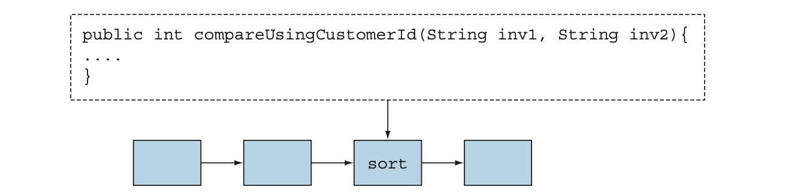

## **Chapter 01: What's Happening?**

## Table of Contents

- [**Chapter 01: What's Happening?**](#chapter-01-What's-happening?)
- [Table of Contents](#table-of-contents)

  - [What is the big story?](#what-is-the-big-story-?)

  - [Why is Java Still Changing](#Why-Is-Java-Still-Changing)
  - [Functions in Java](#functions-in-java)
  - [Streams](#streams)
  - [Default Methods and Java Modules](#default-methods-and-java-modules)
  - ### [Other Good Ideas from functional programming](#other-good-ideas-from-functional-programming)

---

### **What is the big story?**

- The changes enable you to write programs more easily.
- For Example :

  ```java

  Collections.sort(inventory, new Comparator<Apple>() {
    public int compare(Apple a1, Apple a2){
        return a1.getWeight().compareTo(a2.getWeight());
    }
  });

  ```

- in Java 8

```java
    inventory.sort(comparing(Apple::getWeight));
```

### **A hardware influence:**

- CPUs have become multicore
- But the vast majority of existing Java programs use only one of these cores and leave the other three idle.
- Java 8 gave us a new, simpler way of thinking about parallelism.

#### **Java 8 provides a new API (called Streams)**

- supports many parallel operations to process data and resembles the way you might think in database query languages—

**[⬆ back to top](#table-of-contents)**

---

### **Why is Java Still Changing**

- Java's place in the programming language ecosystem
- Java has also been successful at colonizing various aspects of embedded computing (everything from smart cards, toasters, and set-top boxes to car-braking systems).
- #### **But the climate is changing for the programming language ecosystem:**
  - programmers are increasingly dealing with so-called big data
  - wishing to exploit multicore computers or computing clusters effectively to process it.
- **_this means using parallel processing_**
  - something Java wasn’t previously friendly to.
- Another climate-change factor for Java
  - a large system to incorporate large component subsystems
  - these components and their interfaces also tend to evolve.
  - Java 8 and Java 9 have addressed these aspects by providing default methods and modules to facilitate this design style.

### The three programming concepts that drove the design of Java 8.

- ### Stream processing

- First programming concept is stream processing.

  - a stream is a sequence of data items that are conceptually produced one at a time.
  - read items from an input stream one by one and similarly write items to an out- put stream.
  - The output stream of one program could well be the input stream of another.

- **One practical example**

  - cat creates a stream by concatenating two files,
  - tr translates the characters in a stream,
  - sort sorts lines in a stream, and
  - tail -3 gives the last three lines in a stream.
  - linked together with pipes (|).

  ```shell
   cat file1 file2  |  tr "[A-Z]"  "[a-z]"  |  sort  |  tail -3
  ```

  - tr after first translating them to lowercase.
  - sort takes a stream of lines3 as input and produces another stream of lines as output (the latter being sorted),
  - (cat, tr, sort, and tail) are executed concurrently,
  - so that sort can be processing the first few lines before cat or tr has finished.


- **Java 8 adds Stream API**

  ```java
  Stream<T>
  ```

  - a sequence of item of type T.

  - The Streams API has many methods that can be chained to form a complex pipeline.

- **Passing code to methods with behavior parameterization**
  - The second programming concept added to Java 8 is the ability to pass a piece of code to an API
  - Java 8 adds the ability to pass methods (your code) as argu- ments to other methods.
  - this conceptually as behavior parameterization.



**[⬆ back to top](#table-of-contents)**

---

### **Functions in Java**

- The word function in programming languages is commonly used as a synonym for method,
- Java 8 adds functions as new forms of value.
- These facilitate the use of streams to exploit parallel programming on multi- core processors.
- functions as values are useful in themselves.

**Methods and lambdas as first-class citizens**

- methods to be used as first-class values made programming easier by adding to the toolset available to programmers
- The designers of Java 8 decided to allow methods to be values—to make it easier for you to program.
- The first new Java 8 feature : method references.

example

```java
 File[] hiddenFiles = new File(".").listFiles(new FileFilter() {
            public boolean accept(File file) {
return file.isHidden(); Filtering hidden files! }
});
```

**That's Horrible**

- using Java 8

```java
// method Reference
File[] hiddenFiles = new File(".").listFiles(File::isHidden);

```

### **Passing code: an example:**

- A class Apple with a method getColor and a variable inventory holding a list of Apples;
- select all the green apples and
- return them in a list.

before Java 8s

```java

  public static List<Apple> filterGreenApples(List<Apple> inventory) {
    List<Apple> result = new ArrayList<>();
    for (Apple apple : inventory) {
      if ("green".equals(apple.getColor())) {
        result.add(apple);
      }
    }
    return result;
  }
```

- next, somebody would like the list of heavy apples (say over 150 g),

---

### Streams

- Nearly every Java application makes and processes collections.

- let’s say you need to filter expensive transactions from a list and then group them by currency.

- You need to iterate through the elements one by one using a for- each loop processing them in turn.
- iterating over data external itera- tion.

```java

Map<Currency, List<Transaction>> transactionsByCurrencies =
new HashMap<>();
for (Transaction transaction : transactions) {

    if(transaction.getPrice() > 1000){

    Currency currency = transaction.getCurrency();

    List<Transaction> transactionsForCurrency =
    transactionsByCurrencies.get(currency);

    if (transactionsForCurrency == null) {
        transactionsForCurrency = new ArrayList<>();
        transactionsByCurrencies.put(currency,transactionsForCurrency);
    }
    transactionsForCurrency.add(transaction);

}}

```

- **Using the Streams API**
- using the Streams API, you don’t need to think in terms of loops. The data processing happens internally inside the library.

```java
import static java.util.stream.Collectors.groupingBy;
Map<Currency, List<Transaction>> transactionsByCurrencies =
    transactions.stream()
                .filter((Transaction t) -> t.getPrice() > 1000)
                .collect(groupingBy(Transaction::getCurrency));
```

### Multithreading is difficult

- writing multithreaded code is difficult. (using the Threads API from previous versions of Java)

  - threads can access and update shared variables at the same time.
  - As a result, data could change unexpectedly if not coordinated6 properly.

- Java 8 also addresses both problems with the Stream API.

  - boilerplate and obscurity involving processing collections and
  - difficulty exploiting multicore

  - filtering data based on a criterion
  - extracting data
  - grouping data

- such operation can often be **_parallelized_**.

### example

- filter heavy apples from a list sequentially

```java
import static java.util.stream.Collectors.toList;

List<Apple> heavyApples =
    inventory.stream().filter((Apple a) -> a.getWeight() > 150) .collect(toList());

```

- using parallel processing:

```java
  import static java.util.stream.Collectors.toList;

  List<Apple> heavyApples =
  inventory.parallelStream().filter((Apple a) -> a.getWeight() > 150) .collect(toList());

```

---

### Default methods and Java modules

- First, Java 9 provides a module system

  - modules containing collections of packages

  - to keep much better control over visibility and namespaces.

  - Modules enrich a simple JAR-like component with structure, both as user documentation and for machine checking;

- Second, Java 8 added default methods to support evolvable interfaces.

### Other good ideas from functional programming

- using methods and lambdas as first-class values,
- and the idea that calls to functions or methods can be efficiently and safely executed in parallel in the absence of mutable shared state.

- Java 8 introduced the Optional<T> class

  - To avoid null-pointer exceptions.

  - It’s a container object that may or may not contain a value.

  - Optional<T> includes methods to explicitly deal with the case where a value is absent, and as a result you can avoid null-pointer exceptions
