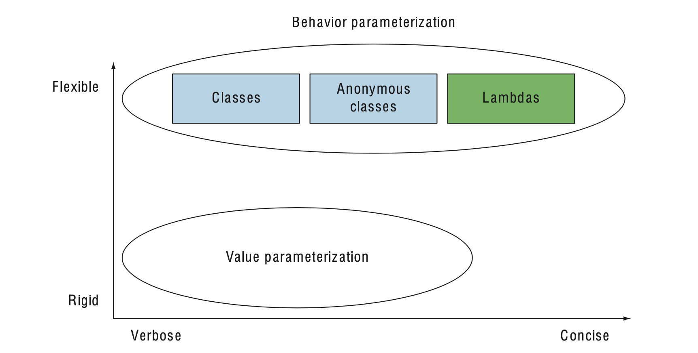

## Passing code with behavior parameterization

### [Table of Contents](#table-of-contents)

- [Coping with changing requirements](#coping-with-changing-requirements)
- [Behavior parameterization](#behavior-parameterization)
- [Tackling verbosity](#tackling-verbosity)

---

- user requirements will change.

- For example

  - find all green apples in his inventory
  - find all apples heavier than 150 g.
  - find all apples that are green and heavier than 150 g.

- How can you cope with these changing requirements?
- Behavior parameterization is a software development pattern that lets you handle frequent requirement changes.

### What is Behavior parameterization Mean ?

- taking a block of code and making it available without executing it.
- pass the block of code as an argument to another method that will execute it later.

### Coping with changing requirements

- filter green apples from a list. Sounds easy, right?

#### **First attempt: filtering green apples**

- a Color enum with a set of colors, such as GREEN, available.

```java

public static List<Apple> filterGreenApples(List<Apple> inventory){

    List<Apple> result = new ArrayList<>();
    for(Apple apple: inventory){
    if( GREEN.equals(apple.getColor() ) {
                result.add(apple);
        }
    }
    return result;
}

```

- now to also filter red apples.
- rename it as filterRedApples,
- and change the if condition to match red apples.
- this approach doesn’t cope well with changes if the farmer wants multiple colors.

#### A good principle is this:

    -  when you find yourself writing nearly repeated code, try to abstract instead.

### Second attempt: parameterizing the color

```java

public static List<Apple> filterApplesByColor(List<Apple> inventory, Color color) {
    List<Apple> result = new ArrayList<>();
    for (Apple apple: inventory) {
    if ( apple.getColor().equals(color) ) {
        result.add(apple);
        }
    }
    return result;
}

```

- now the farmer happy and invoke the methods as follows:

```java

List<Apple> greenApples = filterApplesByColor(inventory, GREEN);

List<Apple> redApples = filterApplesByColor(inventory, RED);

```

## BUT the Farmer COME BACK !

- To differentiate between light apples and heavy apples.
- Heavy apples typically have a weight greater than 150 g.”s

```java

public static List<Apple> filterApplesByWeight  (List<Apple> inventory, int weight) {

    List<Apple> result = new ArrayList<>();
    For (Apple apple: inventory){
        if ( apple.getWeight() > weight ) {
            result.add(apple);
        }
    }
    return result;
}
```

- smell code
  - duplicate most of the implementation for traversing the inventory and applying the filtering criteria on each apple.
- it breaks the DRY (don’t repeat yourself) principle of software engineering.

### Third attempt: filtering with every attribute you can think of

- An ugly attempt to merge all attributes might be as follows:

```java
public static List<Apple> filterApples(List<Apple> inventory, Color color, int weight, boolean flag) {
    List<Apple> result = new ArrayList<>();
    for (Apple apple: inventory) {
    if ( (flag && apple.getColor().equals(color)) || (!flag && apple.getWeight() > weight) ){
            result.add(apple);
        }
    }
    return result;
}
```

- You could use this as follows (but it’s ugly):

```java

    List<Apple> greenApples = filterApples(inventory, GREEN, 0, true);
    List<Apple> heavyApples = filterApples(inventory, null, 150, false);

```

- **extremely bad**.

  - First, the client code looks terrible.

  - What do true and false mean?

  - doesn’t cope well with changing requirements.
  - What if to filter with different attributes of an apple,

  - for example, its size, its shape, its origin, and so on?

  - for more complicated queries that combine attributes, such as green apples that are also heavy?

  - You’d either have multiple duplicated filter methods or one hugely complex method.

---

### Behavior parameterization

- One possible solution is to model your selection criteria:
- is it green?
- Is it heavier than 150 g?
- We call this a predicate.
  - (a function that returns a boolean).
- define an interface to model the selection criteria:

```java

public interface ApplePredicate{
    boolean test (Apple apple);
}

```

- declare multiple implementations of ApplePredicate to represent dif- ferent selection criteria

```java

// Selects only heavy apples
public class AppleHeavyWeightPredicate implements ApplePredicate {

    public boolean test(Apple apple) {
        return apple.getWeight() > 150;
    }
}

// Selects only green apples

public class AppleGreenColorPredicate implements ApplePredicate {
    public boolean test(Apple apple) {
        return GREEN.equals(apple.getColor());
    }
}
```

- To make use of the different implementations of ApplePredicate.

- filterApples method to accept ApplePredicate objects to test a condition on an Apple.

### Fourth attempt: filtering by abstract criteria

```java

 public static List<Apple> filterApples(List<Apple> inventory, ApplePredicate p) {
        List<Apple> result = new ArrayList<>();
        for (Apple apple : inventory) {
            if (p.test(apple)) {
                result.add(apple);
            }
        }
        return result;
    }

```

- the behavior of the filterApples method depends on the code you pass to it via the ApplePredicate object. You’ve parameterized the behavior of the filterApples method!

### MULTIPLE BEHAVIORS, ONE PARAMETER

- Tt separates the logic of iterating the collection to filter and the behavior to apply on each element of that collection.

- Can reuse the same method and give it different behaviors to achieve different things,

  

---

### **Tackling verbosity**

- to pass new behavior to your filterApples method,
- declare several classes that implement the ApplePredicate interface
- instantiate several ApplePredicate objects that you allocate only once.

**_There’s a lot of verbosity involved and it’s a time-consuming process!_**

### Can you do better code?

- Java has mechanisms called anonymous classes, which let you declare and instantiate a class at the same time.

### Anonymous classes

- Anonymous classes are like the local classes (a class defined in a block)

### Fifth attempt: using an anonymous class

```java
	var myRedApples = filterApples(inventory, new ApplePredicate() {

			@Override
			public boolean test(Apple apple) {
				return Color.RED.equals(apple.getColor());
			}
	});
	myRedApples.forEach(a->System.out.println(a));
```

### Sixth attempt: using a lambda expression

- lambda expressions can help you in your quest for clean code.

- The previous code can be rewritten as follows in Java 8 using a lambda expression:

```java

	var  results = filterApples(inventory, (Apple apple)-> Color.GREEN.equals(apple.getColor()));
	results.forEach(a->System.out.println(a));

```

### **_summarizes our journey so far._**

- **_Behaviour parameterization versis value parameterization_**

  

### Seventh attempt: abstracting over List type

```java

// generic filter methods
public static <T> List<T> filter(List<T> list,Predicate<T> p){
		List<T> result = new ArrayList<T>();
		for(T e:list) {
			if(p.test(e)) result.add(e);
		}
		return result;
	}

// using filter method
var redApples = filter(inventory,(Apple apple)-> Color.RED.equals(apple.getColor()));
		redApples.forEach(a-> System.out.println(a));

```

### Real World Examples

- ### Sorting with a Comparator

```java
// java.util.Comparator
public interface Comparator<T> {
    int compare(T o1, T o2);
}

```

- create different behaviors for the sort method by creating an ad hoc implementation of Comparator. For example,
  - using an anonymous class:

```java

inventory.sort(new Comparator<Apple>() {
  public int compare(Apple a1, Apple a2) {
    return a1.getWeight().compareTo(a2.getWeight());
  }
});

```

- If the farmer changes his mind about how to sort apples,

- With a lambda expression it would look like this:

```java
inventory.sort(
  (Apple a1, Apple a2)
  -> a1.getWeight().compareTo(a2.getWeight()));
```
