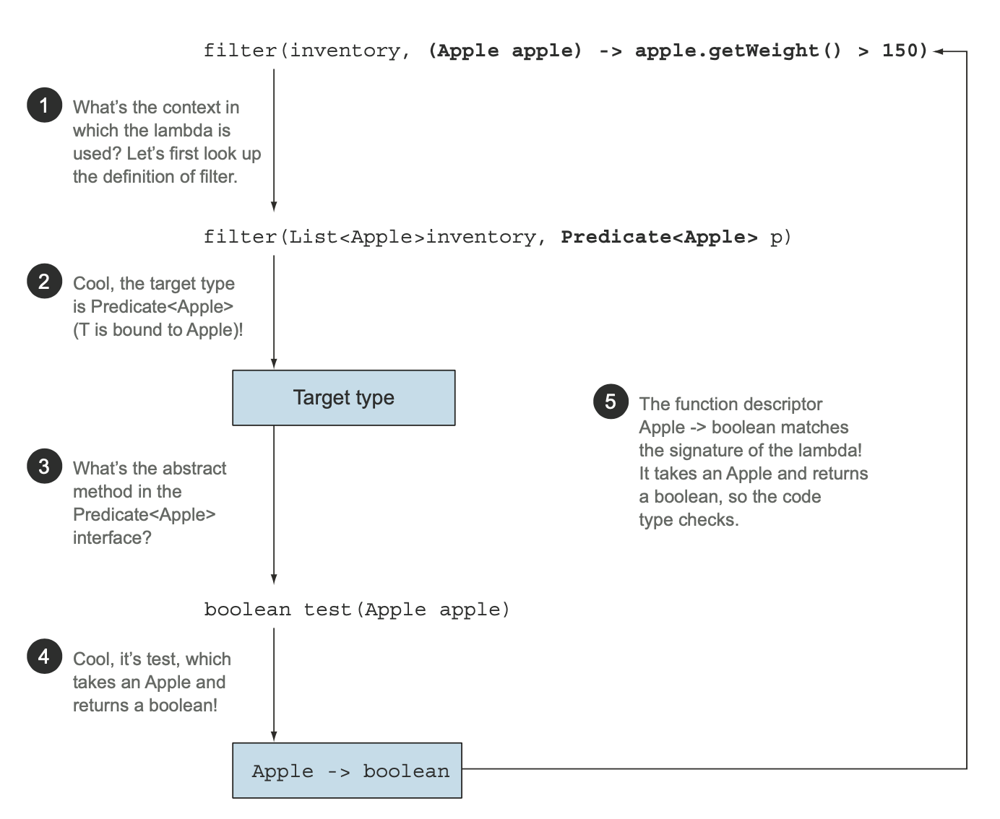

## **Chapter 03 : Lambda Expressions**

[Table of Contents](#table-of-contents)

- [Lambda Expressions](#lambda-expressions)
- [Lambdas in a nutshell](#lambdas-in-a-nutshell)
- [Where and how to use lambdas](#where-and-how-to-use-lambdas)
- [Using Functional interfaces](#using-functional-interfaces)
- [Type checking, type inference, and restrictions](#type-checking-type-inference-and-restrictions)
  - [Type inference](#type-inference)
  - [Using local variables](#using-local-variables)
- [Method references](#method-references)

---

### Lambda Expressions

- passing code with behavior parameterization is useful.

- using this concept you can write code that’s more flexible and reusable.

- **But** It’s **_verbose_**, which doesn’t encourage programmers to use behavior parameterization in practice.

#### **lambda to rescue !**

- Java 8 that tackles this problem: **_lambda expressions_**.

- They let you represent a behavior or pass code in a concise way.

- lambda expressions as anonymous functions, methods without declared names.

- can also be passed as arguments to a method.

---

### **Lambdas in a nutshell**

- **_A lambda expression_** an anonymous function that can be passed around.

  - **_Anonymous_** : it doesn’t have an explicit name like a method would normally have.

  - **_Function_** : a lambda has a list of parameters, a body, a return type, and a possible list of exceptions that can be thrown.

  - **_Passed around_** : A lambda expression can be passed as argument to a method or stored in a variable.

  - **_Concise_** : You don’t need to write a lot of boilerplate.

#### _example_

- before

```java
Comparator<Apple> byWeight = new Comparator<Apple>() {
    public int compare(Apple a1, Apple a2){
        return a1.getWeight().compareTo(a2.getWeight());
    }
};
```

- After (with lambda expressions):

```java
 Comparator<Apple> byWeight =
  (Apple a1, Apple a2) -> a1.getWeight().compareTo(a2.getWeight());
```

#### _result : the code looks clearer!_

---

- The lambda just showed you has three parts


- A list of parameters : a Comparator—two Apples.
- An arrow—The arrow -> separates the list of parameters from the body of the lambda.

- The body of the lambda : Compare two Apples using their weights. The expression is considered the lambda’s return value.

### **Valid lambda expressions in Java 8**

- take one parameter of type String and return an int.

  ```java
  (String s) -> s.length()
  ```

- Takes one parameter of type Apple and returns a boolean (whether the apple is heavier than 150 g).

  ```java
  (Apple a) -> a.getWeight() > 150
  ```

- Takes two parameters of type int and returns no value (void return). Its body contains two statements.

  ```java
  (int x, int y) -> {
      System.out.println("Result:");
      System.out.println(x + y);
  }
  ```

- Takes no parameter and returns the int 42

  ```java
  () -> 42
  ```

- Takes two parameters of type Apple and returns an int representing the comparison of their weights

  ```java
  (Apple a1, Apple a2) -> a1.getWeight().compareTo(a2.getWeight())
  ```

---

#### **Examples of lambdas**


---

### **Where and how to use lambdas**

- _Where exactly can you use lambdas?_

  - in the context of a functional interface.

- In the code shown here,

  - pass a lambda as second argument to the method filter.

  - because of type Predicate<T>, which is a functional interface.

```java
List<Apple> greenApples =
  filter(inventory, (Apple a) -> GREEN.equals(a.getColor()));

```

### Functional interface

- a functional interface is an interface that specifies exactly **_one abstract method_**.

- **_others functional interfaces in the Java API_**

```java

public interface Comparator<T> {
    int compare(T o1, T o2);
}

public interface Runnable {
    void run();
}

public interface ActionListener extends EventListener {
    void actionPerformed(ActionEvent e);
}

public interface Callable<V> {
    V call() throws Exception;
}

public interface PrivilegedAction<T> {
    T run();
}

```

### **Using Functional interfaces**

- a functional interface specifies exactly one abstract method.
- Java 8 have helped you by introducing several new functional interfaces inside the java.util.function package.
  - Predicate
  - Consumer
  - Function

#### **_Predicate_**

- defines an abstract method named test that accepts an object of generic type T and returns a boolean.

- working with a Predicate


---

#### **_Consumer_**

- defines an abstract method named accept that takes an object of generic type T and returns no result (void).

- access an object of type T and perform some oper- ations on it.

```java
  @FunctionalInterface
  public interface Consumer<T> {
            void accept(T t);
  }

  public <T> void forEach(List<T> list, Consumer<T> c) {
      for(T t: list) {
          c.accept(t);
      }
}

forEach(
  Arrays.asList(1,2,3,4,5),
  (Integer i) -> System.out.println(i));
```

---

#### **_Function_**

- defines an abstract method named apply that takes an object of generic type T as input and returns an object of generic type R.

- define a lambda that maps information from an input object to an output

- for example:

  - extracting the weight of an apple or mapping a string to its length

  

---

### **_PRIMITIVE SPECIALIZATIONS_**

- Boxed values are :

  - a wrapper around primitive types and are stored on the heap.
  - use more memory and require additional memory lookups to fetch the wrapped primitive value.

- Java 8 added a specialized version of the functional interfaces.

- To avoid autoboxing operations when the inputs or outputs are primitives.

- For example,
  - using an IntPredicate avoids a boxing operation of the value 1000,
  - whereas using a Predicate<Integer> would box the argument 1000 to an Integer object:


- In general,

  - the appropriate primitive type precedes the names of functional interfaces that have a specialization for the input type parameter
  - **_for example_**,
  - DoublePredicate,

  - IntConsumer,

  - LongBinaryOperator,

  - IntFunction, and so on.

  - The Function interface also has variants for the output type parameter:
  - ToIntFunction<T>,
  - IntToDouble- Function, and so on

#### _Common functional interfaces added in Java 8_


---

#### _Examples of lambdas with functional interfaces_


---

### **_Type checking type inference and restrictions_**

- a lambda expression itself doesn’t contain the information about which functional interface it’s implementing.

- #### Type checking

  - The type of a lambda is:
    - deduced from the context in which the lambda is used

- look at an example to see what happens behind the scenes when you use a lambda expression.

```java

List<Apple> heavierThan150g =
filter(inventory, (Apple apple) -> apple.getWeight() > 150);

```

- The type-checking process is deconstructed as follows:

  - First, you look up the declaration of the filter method.

  - Second, it expects, as the second formal parameter, an object of type Predi-
    cate<Apple> (the target type).
  - Third, Predicate<Apple> is a functional interface defining a single abstract
    method called test.
  - Fourth, the test method describes a function descriptor that accepts an Apple
    and returns a boolean.
  - Finally, any argument to the filter method needs to match this requirement.

#### _Deconstructing the type-checking process of a lambda expression_



---

### _Same lambda, different functional interfaces_

- the idea of target typing,

- the same lambda expression can be associated with different functional interfaces

- if they have a compatible abstract method signature.

- The following two assignments are therefore valid:

```java
  Callable<Integer> c = () -> 42;
  PrivilegedAction<Integer> p = () -> 42;
```

- both interfaces _Callable and PrivilegedAction_ described functions that accept nothing and return a generic type T.

- a similar example;

```java

  Comparator<Apple> c1 =
  (Apple a1, Apple a2) -> a1.getWeight().compareTo(a2.getWeight());

  ToIntBiFunction<Apple, Apple> c2 =
  (Apple a1, Apple a2) -> a1.getWeight().compareTo(a2.getWeight());

  BiFunction<Apple, Apple, Integer> c3 =
  (Apple a1, Apple a2) -> a1.getWeight().compareTo(a2.getWeight());

```

### Type inference

- The Java compiler deduces what functional interface to associate with a lambda expression from its surrounding context (the target type).

- because the function descriptor is available through the target type.

- the compiler has access to the types of the parameters of a lambda expression, and they can be omitted in the lambda syntax.

- here’s how to create a Comparator object:

```java
// Without type inference
Comparator<Apple> c =
          (Apple a1, Apple a2) -> a1.getWeight().compareTo(a2.getWeight());

// With type inferences

Comparator<Apple> c =
(a1, a2) -> a1.getWeight().compareTo(a2.getWeight());


```

#### Using local variables

- lambda expressions are also allowed to use free variables

  - variables that aren’t the parameters and are defined in an outer scope

- They’re called capturing lambdas.

- For example, the following lambda captures the vari- able portNumber:

```java
 int portNumber = 1337;
  Runnable r = () -> System.out.println(portNumber);
```

---

### Method references

- let you reuse existing method definitions and pass them like lambdas.
- more readable and feel more natural than using
  lambda expressions.

- sorting example with a method reference

```java

//Before:
inventory.sort((Apple a1, Apple a2)
a1.getWeight().compareTo(a2.getWeight()));

// After
inventory.sort(comparing(Apple::getWeight));

```

#### In a nutshell

- shorthand for lambdas calling only a specific method.
- refer to the method by name rather than by a description of how to call it.

#### How does it work ?

- the target reference is placed before the delimiter :: and

- the name of the method is provided after it.
- **_For example:_**

  ```java
  Apple::getWeight
  ```

- reference to the method getWeight
- no brackets are needed after getWeight
- because you’re not calling it at the moment, you’re merely quoting its name

#### method reference is shorthand for the lambda expression


### three main kinds of method references:

- A static method

```java
Integer::parseInt
```

- An instance method of an arbitrary type

```java
String::length
```

- An instance method of an existing object or expression

```java
expensiveTransaction::getValue
```

---

### second method

- For example,

```java
  // the lambda expression
 (String s) -> s.toUpper- Case()
 // can be rewritten as
  String::toUpperCase.
```

### third method

- when you’re calling a method in a lambda to an external object that already exists.
- For example:

```java
// the lambda expression
() -> expensiveTransaction.getValue()
// can be rewritten as
expensiveTransaction::getValue
```

- when you need to pass around a method defined as a private helper.
- For example : say you defined a helper method isValidName:

```java
  private boolean isValidName(String string) {
    return Character.isUpperCase(string.charAt(0));
  }
  //You can now pass this method around in the context of a Predicate<String> using a method reference:

  filter(words, this::isValidName)
```

### method references

- to digest method references:

  
