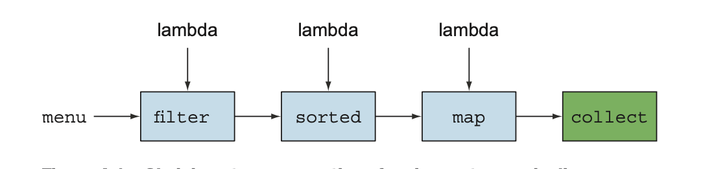
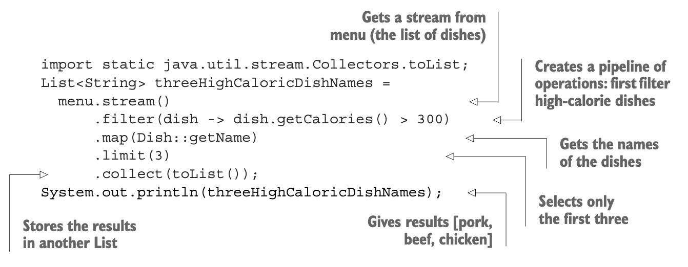
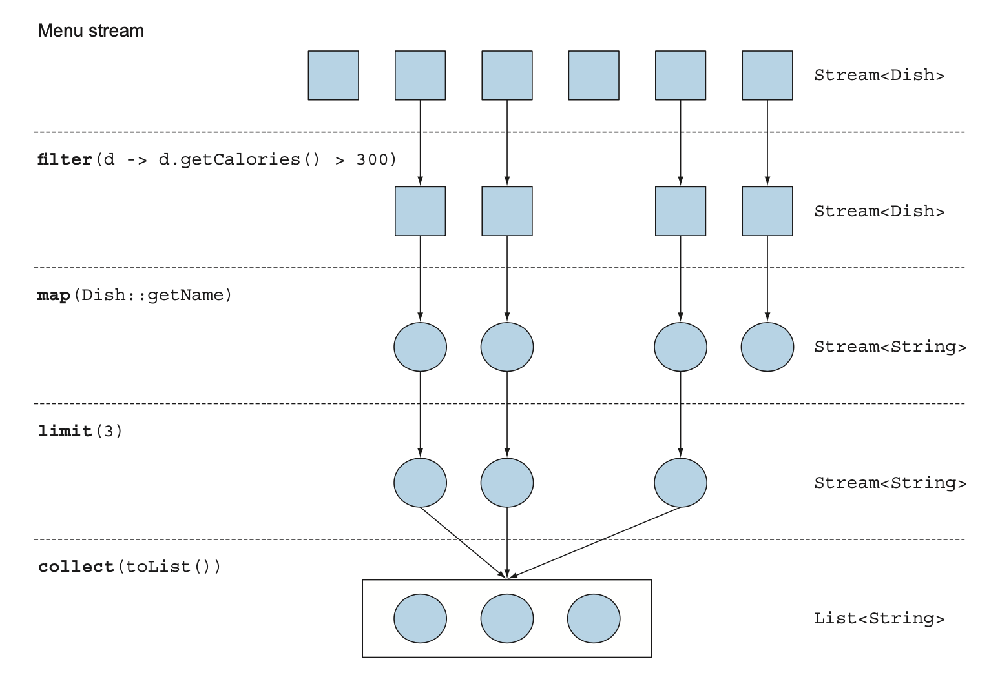
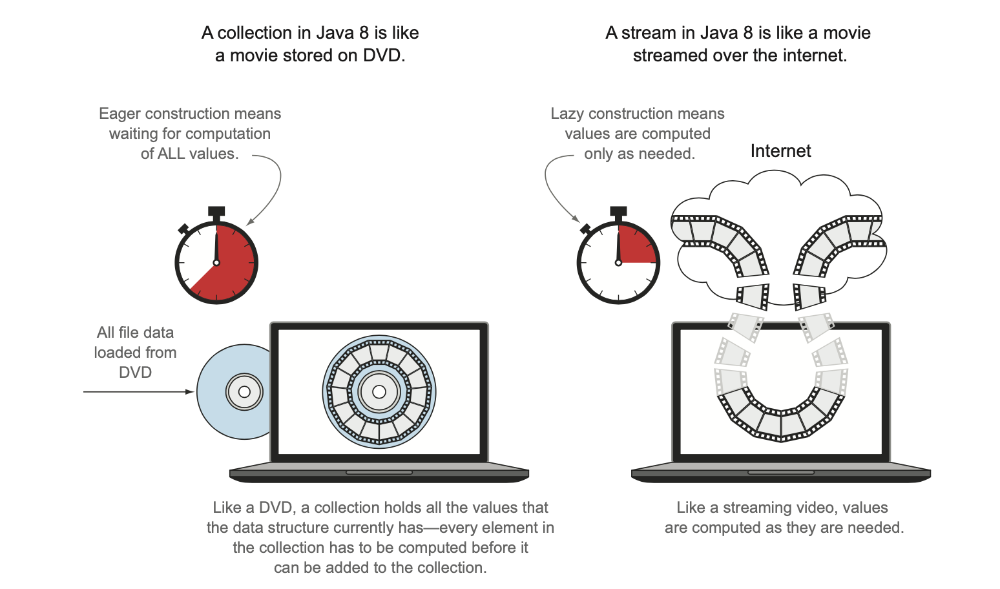

## Introducing Streams

[Table of Contents](#table-of-contents)

- [Introducing Streams](#introducing-streams)
- [Getting started with streams](#getting-started-with-streams)
- [Streams vs collections](#streams-vs-collections)

---

### Introducing Streams

- Collections are fundamental to many programming tasks: they let you group and process data

- To illustrate collections in action :

  - find out the total number of calories for the menu.

  - filter the menu to select only low-calorie dishes for a special healthy menu.

- Most databases let you specify such operations declaratively.
- For example :
  the following SQL query lets you select (or “filter”)the names of dishes that are low in calories:

```shell
SELECT name FROM dishes WHERE calorie<400.
```

- in SQL you don’t need to implement how to filter using the calorie attribute of a dish.

- with Java collections

  - for example: using an iterator and an accumulator.
  - you write what you want as result.

**_Why can’t you do something similar with collections?_**

- To process a large collection of elements?

  - With gain performance

  - you’d need to process it in parallel and use multicore architectures.

- _writing parallel code is complicated in comparison to working with iterators. In addition, it’s no fun to debug!_

- What could the Java language designers do to save your precious time and make your life as programmers easier?

**_the answer is streams_**

### What are Streams

- let you manipulate collections of data in a declarative way.

- express a query rather than code.

- streams can be processed in parallel transparently, without you having to write any multithreaded code!

#### exmaple

- to return the names of dishes that are low in calories, sorted by number of calories

**Before (Java 7)**

```java

  public static List<String> getLowCaloricDishesNamesInJava7(List<Dish> dishes) {
    List<Dish> lowCaloricDishes = new ArrayList<>();
    for (Dish d : dishes) {
      if (d.getCalories() < 400) {
        lowCaloricDishes.add(d);
      }
    }
    List<String> lowCaloricDishesName = new ArrayList<>();
    Collections.sort(lowCaloricDishes, new Comparator<Dish>() {
      @Override
      public int compare(Dish d1, Dish d2) {
        return Integer.compare(d1.getCalories(), d2.getCalories());
      }
    });
    for (Dish d : lowCaloricDishes) {
      lowCaloricDishesName.add(d.getName());
    }
    return lowCaloricDishesName;
  }
```

**After (Java 8)**

```java
 public static List<String> getLowCaloricDishesNamesInJava8(List<Dish> dishes) {
    return dishes.stream()
        .filter(d -> d.getCalories() < 400)
        .sorted(comparing(Dish::getCalories))
        .map(Dish::getName)
        .collect(toList());
  }
```

- The code is written in a declarative way: you specify what you want to achieve.

  - (filter dishes that are low in calories)



- You chain together several building-block operations to express a complicated data-processing pipeline.

- while keeping your code readable and its intent clear.

  - The result of the filter is passed to

  - the sorted method, which is then passed to

  - the map method and then to

  - the collect method.

- Because these operations are available as high-level building blocks
- that don’t depend on a specific threading model,

- internal implementation could be

  - single-threaded or
  - could potentially maximize your multicore architecture transparently!

To summarize, the Streams API in Java 8 lets you write code that’s

- Declarative—More concise and readable
- Composable—Greater flexibility
- Parallelizable—Better performance

**_how you can use the Streams API in more detail_**

---

### Getting started with streams

- First, what exactly is a stream?.

- A short definition is :

  - _“a sequence of elements from a source that supports data-processing operations.”_

#### Break down this definition step-by-step:

- **Sequence of elements**:

  - Like a collection ,

  - a stream provides an interface to a sequenced set of values of a specific element type.

  - Collections are about data; streams are about computa- tions.

- **Source** :

  - Streams consume from a data-providing source such as collections, arrays, or I/O resources.

- **Data-processing operations** :

  - Streams support database-like operations and

  - common operations from functional programming languages to manipulate data,

  - such as filter, map, reduce, find, match, sort, and so on.

  - Stream operations can be executed either sequentially or in parallel

#### stream operations have two important characteristics:

- **Pipelining** :

  - Many stream operations return a stream themselves

  - allowing operations to be chained to form pipeline.

  - This enables certain optimizations
    - such as laziness and short-circuiting.

- **Internal iteration** :

  - In collections, data are iterated explicitly using an iterator,
  - stream operations do the iteration behind the scenes for you.

_example_


**In this example**

- first get a stream from the list of dishes

- The data source is the list of dishes

- Next, Apply a series of data-processing operations on the stream:

  - filter,

  - map,

  - limit,

  - and collect.

  - All these operations return another stream to form a pipeline.

  - except collect.

- Finally, the collect operation starts processing the pipeline to return a result.

  - (**_a List_**).

  - No result is produced,

  - and indeed no element from menu is even selected,

  - until collect is invoked.

  - think of it as if the method invocations in the chain are queued up until collect is called.

---

#### sequence of stream operations: filter, map, limit, and collect:



- filter :

  - Takes a lambda to exclude certain elements from the stream.

  - you select dishes that have more than 300 calories by passing the lambda d -> d.getCalories() > 300.

- map :

  - Takes a lambda to transform an element into another one or to extract information.

  - you extract the name for each dish by passing the method reference Dish::getName,

  - which is equivalent to the lambda d -> d.getName().

- limit :
  - Truncates a stream to contain no more than a given number of elements.
- collect :
  - Converts a stream into another form.
  - you convert the stream into a list.

---

### Streams vs collections

- Both collections and streams provide interfaces to data structures

  - representing a sequenced set of values of the element type.

- By sequenced, step through the values in turn
- rather than randomly accessing them in any order.

---

#### What’s the difference?

- **In coarsest terms:**

  the difference between collections and streams has to do with when things are computed.

- **A collection** :

  - is an in-memory data structure

  - that holds all the values

  - the data structure currently has—every element in the collection

  - has to be computed before it can be added to the collection.

  - every element in the collection is stored in memory.

  - elements have to be computed before becoming part of the collection.

---

- By contrast,
- **A stream:**
  - is a conceptually fixed data structure
  - (you can’t add or remove elements from it)
  - whose elements are computed on demand.
  - This gives rise to significant programming benefits.

---

- Another view :

  - a stream is like a lazily constructed collection: values are computed when they’re solicited by a consumer

    - demand-driven.

  - In contrast, a collection is eagerly constructed

    - supplier-driven:

#### The difference between a stream and a collection,

- applied to DVD versus internet streaming example :


