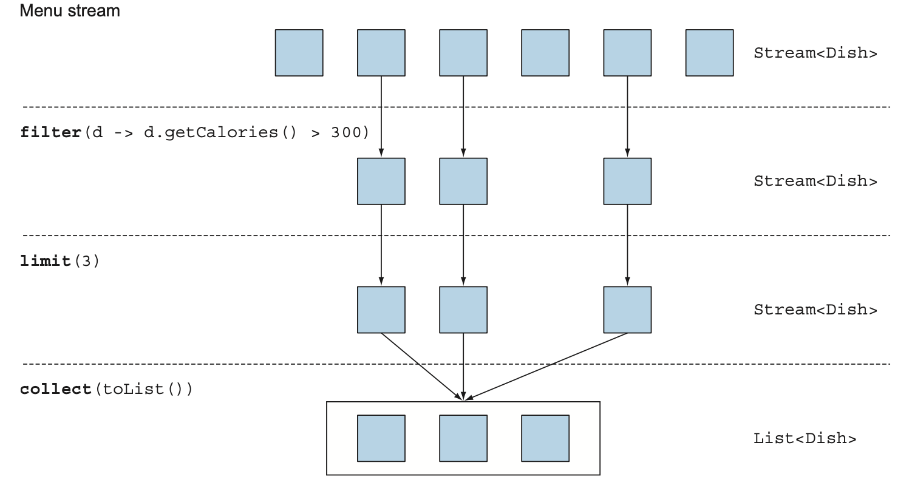
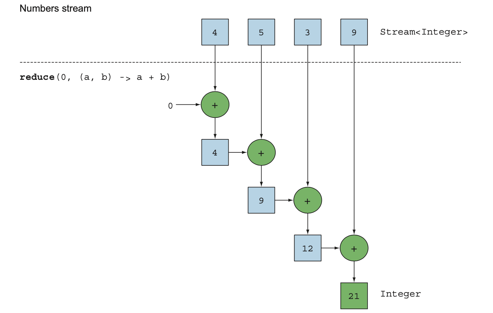

## Working With Stream

### [Table of Contents](#table-of-contents)

- [Working with Stream](#working-with-stream)
- [Filtering](#filtering)
  - [Filtering with a predicate](#filtering-with-a-predicate)
  - [Filtering unique elements](#filtering-unique-elements)
- [Slicing a stream](#slicing-a-stream)
  - [Slicing using a predicate](#slicing-using-a-predicate)
    - [USING TAKEWHILE](#using-takeWhile)
    - [using dropWhile](#using-dropWhile)
    - [Truncating a stream](#truncating-a-stream)
    - [Skipping elements](#skipping-elements)
- [Mapping](#mapping)
  - [Flattening streams](#flattening-streams)
- [Finding and matching](#finding-and-matching)
  - [AnyMatch](#anymatch)
  - [AllMatch](#allmatch)
  - [NONEMATCH](#NONEMATCH)
  - [findAny](#findAny)
  - [Finding the first element](#finding-the-first-element)
- [Reducing](#reducing)
  - [Summing the elements](#summing-the-elements)
  - [Maximum and minimum](#maximum-and-minimum)
- [Putting it all into practice](#putting-it-all-into-practice)
- [Numeric streams](#numeric-streams)
  - [Primitive stream specializations](#primitive-stream-specializations)
  - [MAPPING TO A NUMERIC STREAM](#MAPPING-TO-A-NUMERIC-STREAM)
  - [Default Value: OptionalInt](#default-value:-OptionalInt)
  - [Numeric ranges](#numeric-ranges)

---

### Working with Stream

- Using Streams API
  - internal iteration,
  - can decide to run your code in parallel.

---

### Filterinng

- to select elements of a stream: filtering with a predicate and filtering only unique elements.

### Filtering with a predicate

- The Stream interface supports a filter method
- takes as argument a predicate
- returns a stream including all elements that match the predicate.


```java

List<Dish> vegetarianMenu = menu.stream()
    .filter(Dish::isVegetarian)
    .collect(toList());

```

### Filtering unique elements

- Streams support a method called distinct
- that returns a stream with unique elements

```java
List<Integer> numbers = Arrays.asList(1, 2, 1, 3, 3, 2, 4);
numbers.stream()
       .filter(i -> i % 2 == 0)
.distinct()
       .forEach(System.out::println);
```


### Slicing a stream

- to select and skip elements in a stream in different ways.
- There are operations available that let you efficiently
  - select or drop elements using a predicate,
  - ignore the first few elements of a stream, or truncate a stream to a given size.

### Slicing using a predicate

- Java 9 added two new methods that are useful for efficiently selecting elements in a stream:
  - **_takeWhile_** and
  - **_dropWhile_**.

#### USING TAKEWHILE

```java
   List<Dish> specialMenu = Arrays.asList(
            new Dish("seasonal fruit", true, 120, Dish.Type.OTHER),
            new Dish("prawns", false, 300, Dish.Type.FISH),
            new Dish("rice", true, 350, Dish.Type.OTHER),
            new Dish("chicken", false, 400, Dish.Type.MEAT),
            new Dish("french fries", true, 530, Dish.Type.OTHER));
```

**_select the dishes that have fewer than 320 calories?_**

- using the operation filter method.

```java
List<Dish> filteredMenu
    = specialMenu.stream()
                 .filter(dish -> dish.getCalories() < 320)
                 .collect(toList());
```

- downside

  - need to iterate through the whole stream and the predicate is applied to each element.

---

### takeWhile

- stop once you found a dish that is greater than (or equal to) 320 calories.

- The takeWhile operation lets you slice any stream (even an infinite stream ) using a predicate.

```java
List<Dish> slicedMenu1
    = specialMenu.stream()
    .takeWhile(dish -> dish.getCalories() < 320)
    .collect(toList());

```

### using dropWhile

- Getting the other elements though?
- finding the elements that have greater than 320 calories?
- the dropWhile operation for this:

```java
List<Dish> slicedMenu2
    = specialMenu.stream()
                 .dropWhile(dish -> dish.getCalories() < 320)
                 .collect(toList());
// Lists rice, chicken, french fries
```

- The dropWhile is the complement of takeWhile.
- It throws away the elements at the start where the predicate is false.
- Once the predicate evaluates to true it stops and returns all the remaining elements, and
- it even works if there are an infinite number of remaining elements!

### Truncating a stream

- Streams support the limit(n) method,
- returns another stream that’s no longer than a given size.
- The requested size is passed as argument to limit.
- If the stream is ordered, the first elements are returned up to a maximum of n.

```java
List<Dish> dishes =
specialMenu.stream()
        .filter(dish -> dish.getCalories() > 300)
        .limit(3)
        .collect(toList());
// Lists rice, chicken, french fries
```

- only the first three elements that match the predicate are selected, and the result is immediately returned.



---

### Skipping elements

- Streams support the skip(n) method to return a stream that discards the first n elements.
- If the stream has fewer than n elements, an empty stream is returned.
- Note that limit(n) and skip(n) are complementary!

```java
  List<Dish> dishes = menu
            .stream()
            .filter(d -> d.getCalories() > 300)
            .skip(2)
            .collect(toList());
```


---

### Mapping

- to select information from certain objects.
- The Streams API provides similar facilities through the map and flatMap methods.

#### Applying a function to each element of a stream

- the map method, which takes a function as argument.
- The function is applied to each element, mapping it into a new element.
- “creating a new version of” rather than “modifying”.

```java
List<String> dishNames = menu.stream()
                             .map(Dish::getName)
                             .collect(toList());
```

- Given a list of words, you’d like to return a list of the number of characters for each word.

```java
List<String> words = Arrays.asList("Modern", "Java", "In", "Action");
List<Integer> wordLengths = words.stream()
                                 .map(String::length)
                                 .collect(toList());

```

### Flattening streams

- return a list of all the unique characters for a list of words?
- For example,
  - ["Hello," "World"]
  - return the list ["H,""e,""l,""o,""W,""r,""d"].

```java
	List<String> words = Arrays.asList("Hello","World");
		var result = words.stream()
				.map(word-> word.split(""))
				.flatMap(Arrays::stream)
				.distinct()
				.collect(Collectors.toList());
		System.out.println(result);
```

---

### Finding and matching

- The Streams API provides such facilities through
- the allMatch, anyMatch, noneMatch, findFirst, and findAny methods of a stream.

### anyMatch

- matches at least one element.

- The anyMatch method returns a boolean and is therefore a terminal operation.

- “Is there an element in the stream matching the given predicate?”.

```java
 if(menu.stream().anyMatch(Dish::isVegetarian)) {
            System.out.println("The menu is (somewhat) vegetarian friendly!!");
  }

```

---

### allMatch

- matches all elements.

- check to see if all the ele- ments of the stream match the given predicate.

```java
  boolean isHealthy = menu.stream()
                                .allMatch(dish -> dish.getCalories() < 1000);
```

---

### NONEMATCH

- The opposite of allMatch is noneMatch.

```java
 boolean isHealthy = menu.stream()
                                .noneMatch(d -> d.getCalories() >= 1000);

```

---

### findAny

- The findAny method returns an arbitrary element of the current stream. It can be used in conjunction with other stream operations.

```java
Optional<Dish> dish =
          menu.stream()
        .filter(Dish::isVegetarian)
        .findAny();

```

### OPTIONAL IN A NUTSHELL

- is a container class to represent the existence or absence of a value.

  - isPresent() returns true if Optional contains a value, false otherwise.
  - ifPresent(Consumer<T> block) executes the given block if a value is present.
  - T get() returns the value if present; otherwise it throws a NoSuchElement-
    Exception.
  - T orElse(T other) returns the value if present; otherwise it returns a default
    value.

#### optional usage


### Finding the first element

- For such streams you may wish to find the first element. There’s the findFirst method for this, which works similarly to findAny

```java
List<Integer> someNumbers = Arrays.asList(1, 2, 3, 4, 5);
Optional<Integer> firstSquareDivisibleByThree =
  someNumbers.stream()
             .map(n -> n * n)
.filter(n -> n % 3 == 0)
.findFirst(); // 9
```

---

### Reducing

- combine elements of a stream to express more complicated queries.

- example

  - “Calculate the sum of all calories in the menu,” or

  - “What is the highest calorie dish in the menu?”

- using the reduce operation.

- Such queries combine all the elements in the stream repeatedly to produce a single value such as an Integer.

- These queries can be classified as reduction operations

  - a stream is reduced to a value.

    - this is referred to as a fold because you can view

  - this operation as repeatedly folding a long piece of paper until it forms a small square, which is the result of the fold operation.

#### Summing the elements

- You reduce the list of numbers into one number by repeatedly using addition.

```java
  int sum = 0;
    for (int x : numbers) {
    sum += x;
   }
```

- There are two parameters in this code:
  - The initial value of the sum variable, in this case 0
  - The operation to combine all the elements of the list, in this case +.

### reduce Method

```java
int sum = numbers.stream().reduce(0, (a, b) -> a + b);
```

- reduce takes two arguments:

  - An initial value, here 0.
  - A BinaryOperator<T> to combine two elements and produce a new value;
  - here the lambda(a,b)->a+b.

- You could just as easily multiply all the elements by passing a different lambda, (a, b)
  -> a \* b, to the reduce operation:

```java
  int product = numbers.stream().reduce(1, (a, b) -> a * b);
```



### Maximum and minimum

- To calculate the minimum, you need to pass Integer.min

  ```java
  Optional<Integer> max = numbers.stream().reduce(Integer::max);
  ```

- To the reduce operation instead of Integer.max:
  ```java
  Optional<Integer> min = numbers.stream().reduce(Integer::min);
  ```
- You could have equally well used the lambda

  - (x, y) -> x < y ? x : y

  - instead of Integer::min, but the latter is definitely easier to read!


---

### Putting it all into practice

- Find all transactions in the year 2011 and sort them by value (small to high).
- What are all the unique cities where the traders work?
- Find all traders from Cambridge and sort them by name.
- Return a string of all traders’ names sorted alphabetically.
- Are any traders based in Milan?
- Print the values of all transactions from the traders living in Cambridge.
- What’s the highest value of all the transactions?
- Find the transaction with the smallest value.

### Solutions

### 1


---

### 2


- drop distinct() and use toSet() instead

```java
   Set<String> cities =
  transactions.stream()
  .map(transaction -> transaction.getTrader().getCity())
  .collect(toSet());
```

---

### 3


---

### 4


- Note that this solution is inefficient.

- (all Strings are repeatedly concatenated, which creates a new String object at each iteration).

- In the next chapter, you’ll see a more efficient solution that uses joining() as follows (which internally makes use of a StringBuilder):

```java
String traderStr =
    transactions.stream()
Listing 5.5
   .map(transaction -> transaction.getTrader().getName())
   .distinct()
   .sorted()
   .collect(joining());
```

---

### 5


---

### 6


---

### 7


---

### 8


- You can do better. A stream supports the methods min and max that take a Comparator as argument to specify which key to compare with when calculating the minimum or maximum:

```java

Optional<Transaction> smallestTransaction =
  transactions.stream()
              .min(comparing(Transaction::getValue

```

---

### Numeric streams

- calculate the number of calories in the menu.

```java
 int calories = menu.stream()
               .map(Dish::getCalories)
               .sum();
```

- this isn’t possible.

### Primitive stream specializations

- three primitive specialized stream interfaces to tackle this issue,
  - IntStream,
  - DoubleStream, and
  - LongStream,

### MAPPING TO A NUMERIC STREAM

- convert a stream to a specialized version are mapToInt, mapToDouble, and mapToLong.

```java
   int calories = menu.stream()
        .mapToInt(Dish::getCalories)
        .sum();
```

### Converting back to a stream of object


### Default Value: OptionalInt

- There’s a primitive specialized version of Optional

- as well for the three primitive stream specializations:

  - OptionalInt,

  - OptionalDouble, and

  - OptionalLong.

- For example, you can find the maximal element of an IntStream by calling the max method, which returns an OptionalInt:

  ```java
  OptionalInt maxCalories =
                  menu.stream()
                  .mapToInt(Dish::getCalories)
                  .max();
  //Provides an explicit default maximum if there’s no value
   int max = maxCalories.orElse(1);
  ```

---

### Numeric ranges

- to generate all numbers between 1 and 100.

- two static methods available on

  - IntStream and

  - LongStream to help generate such ranges:

  - range and rangeClosed.

- Both methods take the starting and the end value of the range parameter.

- But range is exclusive, whereas rangeClosed is inclusive.


