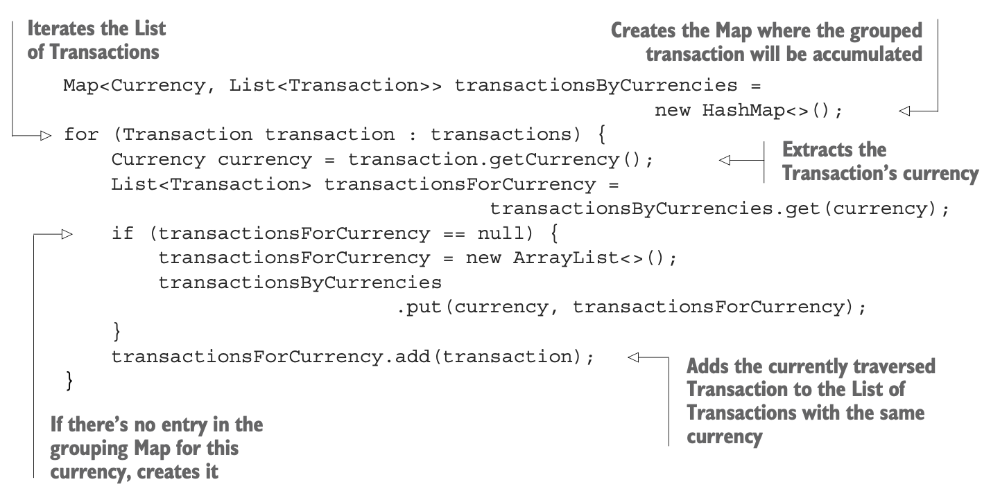
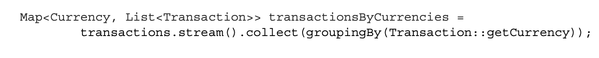
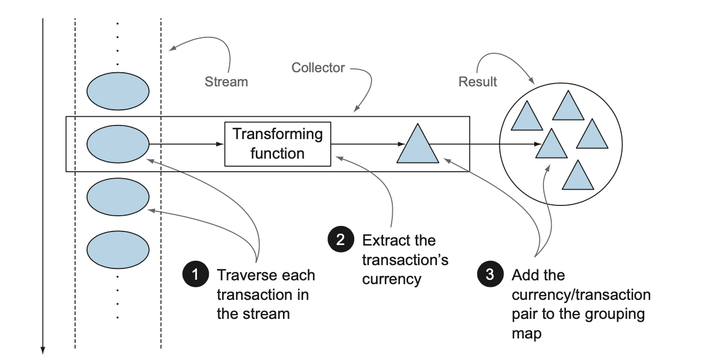
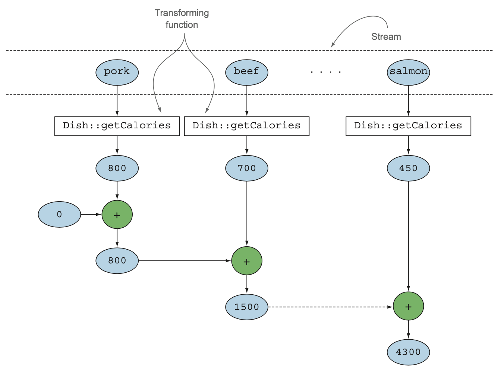
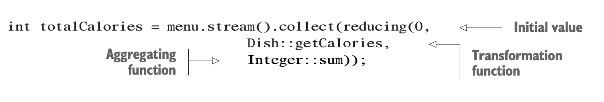
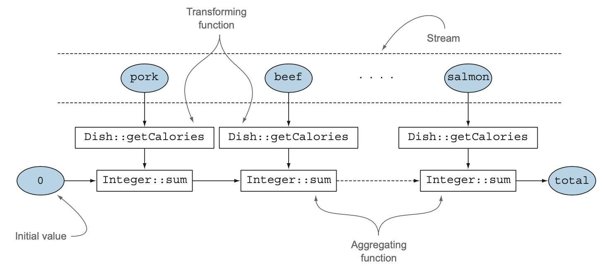
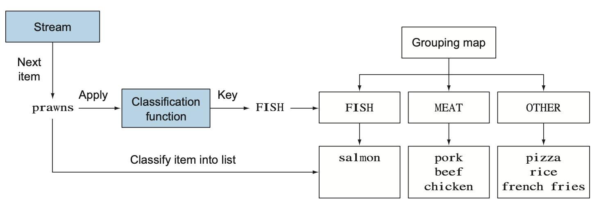

## Chapter-06 : Collecting Data with Streams

- [Collecting Data With Streams](#collecting-data-with-streams)
- [Table of Contents](#table-of-contents)
- [Collectors in a nutshell](#collectors-in-a-nutshell)
- [Collectors as advanced reductions](#collectors-as-advanced-reductions)
- [Predefine Collectors](#predefine-collectors)
  - [Reducing and summarizing](#reducing-and-summarizing)
  - [Finding maximum and minimum](#finding-maximum-and-minimum)
  - [Summarization](#summarization)
  - [Joining Strings](#joining-strings)
  - [Generalized summarization with reduction](#generalized-summarization-with-reduction)
- [Grouping](#grouping)
  - [Manipulating grouped elements](#manipulating-grouped-elements)

---

### Collecting Data With Streams

- example queries of what you’ll be able to do using collect and collectors:

- Group a list of transactions by currency

- to obtain the sum of the values of all transactions with that currency

- (returning a Map<Currency, Integer>)

- Partition a list of transactions into two groups:
- expensive and not expensive (returning a Map<Boolean, List<Transaction>>)

- Create multilevel groupings, such as grouping transactions by cities and

- then further categorizing by whether they’re expensive or not

- (returning a Map<String, Map<Boolean, List<Transaction>>>)

#### before java 8



---

### with Java 8



---

### Collectors in a nutshell

- formulate the result you want to obtain the “what” and not the steps performed to obtain it, the “how.”

- the groupingBy recipe says,
  - “Make a Map whose keys are (currency) buckets and whose values are a list of elements in those buckets.”

### Collectors as advanced reductions

- composability and reusability.

- provide a concise yet flexible way to define the criteria that collect uses to produce the resulting collection.

- reduction operation, does for you internally

- It traverses each ele- ment of the stream and lets the Collector process them.

- the Collector applies a transforming function to the element.

---

#### The reduction process grouping the transactions by currency



---

### Predefine Collectors

- the factory methods provided by the Collectors class.

- These offer three main functionalities:

  - Reducing and summarizing stream elements to a single value
  - Grouping elements
  - Partitioning elements

- _start with collectors that allow you to reduce and summarize_.

### Reducing and summarizing

- Collectors are typically used in cases where it’s necessary to reorganize the stream’s items into a collection.

- To combine all the items in the stream into a single result.

  - This result can be of any type,

  - a multilevel map representing a tree or

  - as simple as a single integer,

  - perhaps representing the sum of all the calories in the menu.

- count the number of dishes in the menu, using the collector returned by the counting factory method:

```java
 long howManyDishes = menu.stream().collect(Collectors.counting());
 // write this far more directly as
 long howManyDishes = menu.stream().count();
```

### Finding maximum and minimum

- To find the highest-calorie dish in the menu.

- use two collec-tors,

  - Collectors.maxBy and

  - Collectors.minBy,

- take a Comparator as argument to compare the elements in the stream.

```java
Comparator<Dish> dishCaloriesComparator =
    Comparator.comparingInt(Dish::getCalories);

Optional<Dish> mostCalorieDish =menu.stream()
        .collect(maxBy(dishCaloriesComparator));
```

---

### Summarization

- A specific factory method for summing: Collectors .summingInt.

  - Accepts a function that maps an object into the int that has to be summed and returns a collector.

  - when passed to collect method,
  - performs the requested summarization.
  - find the total number of calories in your menu list with

```java

  int totalCalories = menu.stream().collect(summingInt(Dish::getCalories));

```

- The Collectors.summingLong and
- Collectors.summingDouble methods behave exactly the same way.

- A Collectors.
  - averagingInt,
  - averagingLong and
  - averagingDouble
  - is also available to calculate the average of the same set of numeric values:

```java
    double avgCalories =
    menu.stream().collect(averagingInt(Dish::getCalories));
```

#### Anther Example

- count the elements in the menu and
  - obtain the sum,
  - average,
  - maximum, and minimum
  - of the calories contained in each dish with a single summarizing operation:
  ```java
  IntSummaryStatistics menuStatistics =
    menu.stream().collect(summarizingInt(Dish::getCalories));
  ```
- the following output:

```shell
IntSummaryStatistics{
    count=9,
    sum=4300,
    min=120,
    average=477.777778,
    max=800
}
```

#### summinngInt Collector



---

### Joining Strings

- the joining factory method concatenates into a single string,

- all strings resulting from invoking the toString method on each object in the stream.

- concatenate the names of all the dishes in the menu :

```java
String shortMenu = menu.stream().map(Dish::getName).collect(joining());
```

- NOTE:

  - joining internally makes use of a StringBuilder to append the generated strings into one.

- without needing to map :

```java
    String shortMenu = menu.stream().collect(joining());
```

- a comma-separated list of the dishes’ names:

```java
 String shortMenu = menu.stream().map(Dish::getName).collect(joining(", "));
```

---

### Generalized summarization with reduction

- The Collectors.reducing factory method is a generalization of all of them.

- to calculate the total calories in your menu with a collector created from the reducing method as follows:

```java

int totalCalories = menu.stream()
    .collect(
    reducing(0, Dish::getCalories, (i, j) -> i + j));

```

- It takes three arguments:

- The first argument is :

  - the starting value

  - and the value returned

  - (in the case of a stream with no elements)

- The second argument is :

  - to transform a dish into an int representing its calorie content.

- The third argument is :
  - aggregates two items into a single value of the same type.

---

- Similarly, you could find the highest-calorie dish using the one-argument version of reducing as follows:

```java
 Optional<Dish> mostCalorieDish =
  menu.stream().collect(reducing(
  (d1, d2) -> d1.getCalories() > d2.getCalories() ? d1 : d2));

```

---

#### COLLECTION FRAMEWORK FLEXIBILITY:

- DOING THE SAME OPERATION IN DIFFERENT WAYS:
- sum example :
  - using the reducing collector
  - by using a reference to the sum method of the Integer class.



- Explain



- without using a collector
  — by mapping the stream of dishes into the number of calories of each dish
- and then reducing this resulting stream with the same method reference used in the previous version:

```java
int totalCalories = menu.stream().map(Dish::getCalories).reduce(Integer::sum).get();
```

---

### Grouping

- to classify the dishes in the menu according to their type,
- putting the ones containing meat in a group,
- the ones with fish in another group, and all others in a third group.

```js
Map < Dish.Type,
  (List < Dish >> dishesByType = menu
    .stream()
    .collect(groupingBy(Dish::getType)));

// result
{FISH=[prawns, salmon], OTHER=[french fries, rice, season fruit, pizza],
 MEAT=[pork, beef, chicken]}
```

- you pass to the groupingBy method a Function.

- extracting the corresponding Dish.Type for each Dish in the stream.

- a classification function is used to classify the elements of the stream into different groups.

- a Map having as map key the value returned by the classification function.

- map value a list of all the items in the stream having that classified value.

- a key is the type of dish, and its value is a list containing all the dishes of that type.



---

- For instance,

- you could decide to classify as :

  - “diet” all dishes with 400 calories or fewer set to “normal”.

  - the dishes having between 400 and 700 calories, and set to “fat”.

  - the ones with more than 700 calories.

```js
public enum CaloricLevel { DIET, NORMAL, FAT }

Map<CaloricLevel, List<Dish>> dishesByCaloricLevel = menu.stream().
    collect(groupingBy(dish -> {
      if (dish.getCalories() <= 400)
      return CaloricLevel.DIET;
      else if (dish.getCalories() <= 700)
      return CaloricLevel.NORMAL;
      else return CaloricLevel.FAT;
    }
));
```

### Manipulating grouped elements

- after performing a grouping operation

- might need to manipulate the elements in each resulting group.

- for example:

  - to filter only the caloric dishes,more than 500 calories.

#### filtering predicate before the grouping like the following:

```java
 Map<Dish.Type, List<Dish>> caloricDishesByType =
       menu.stream()
       .filter(dish -> dish.getCalories() > 500)
       .collect(groupingBy(Dish::getType));
```

- Result: a Map like the following:
- Do you see the problem there?
- No dish of type FISH

```java
 {OTHER=[french fries, pizza], MEAT=[pork, beef]}
```

### filtering method

- To workaround this problem

- the Collectors class overloads the groupingBy factory method,

- with taking a second argument of type Collector along with the usual classification function.

- it’s possible to move the filtering predicate inside this second Collector:

```java
Map<Dish.Type, List<Dish>> caloricDishesByType =
  menu.stream()
      .collect(
      groupingBy(
      Dish::getType,filtering(
      dish -> dish.getCalories() > 500, toList())
      ));
```

**Note**

- filtering method is another static factory method
- accepting a Predicate to filter the elements in each group and
- a further Collector that is used to regroup the filtered elements.

the resulting Map will also
keep an entry for the FISH type even if it maps an empty List:

```js
{OTHER=[french fries, pizza], MEAT=[pork, beef], FISH=[]}
```

- More Example

-convert each Dish in the groups into their respective names in this way:

```js
Map<Dish.Type,List< String >> dishNamesByType =    menu.stream()
    .collect(groupingBy(Dish::getType,
     mapping(Dish::getName, toList()))));
```

```js

Map<String, List<String>> dishTags = new HashMap<>();
dishTags.put("pork", asList("greasy", "salty"));
dishTags.put("beef", asList("salty", "roasted"));
dishTags.put("chicken", asList("fried", "crisp"));
dishTags.put("french fries", asList("greasy", "fried"));
dishTags.put("rice", asList("light", "natural"));
dishTags.put("season fruit", asList("fresh", "natural"));
dishTags.put("pizza", asList("tasty", "salty"));
dishTags.put("prawns", asList("tasty", "roasted"));
dishTags.put("salmon", asList("delicious", "fresh"));
```

In case you are required to extract these tags for each group of type of dishes you can easily achieve this using the flatMapping Collector:

```js

Map<Dish.Type, Set<String>> dishNamesByType =
menu.stream()
  .collect(
  groupingBy(
    Dish::getType,
    flatMapping(dish -> dishTags.get( dish.getName())
   .stream(),
   toSet())));
```

- The Map resulting from this operation is then
  the following:

```js
{
  (MEAT = [salty, greasy, roasted, fried, crisp]),
    (FISH = [roasted, tasty, fresh, delicious]),
    (OTHER = [salty, greasy, natural, light, tasty, fresh, fried]);
}
```
