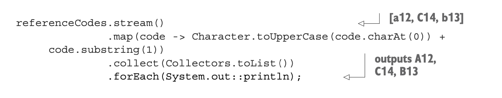
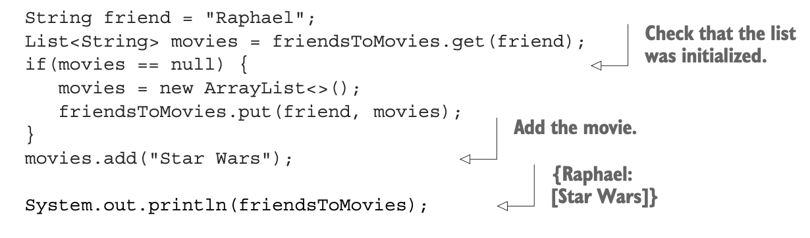
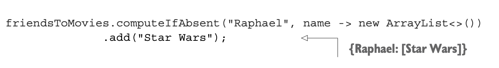
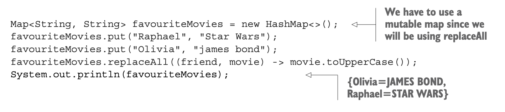
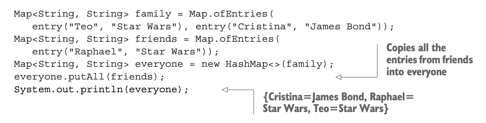
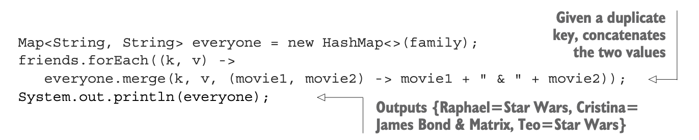
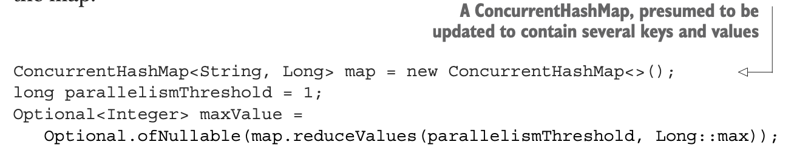

## Chapter-08 : Collection API enhancements

### [Table of Contents](#table-of-contents)

- [Collection factories](#collection-factories)
- [List factory](#list-factory)
- [Set factory](#set-factory)
- [Map factories](#map-factories)
- [Working with List and Set](#working-with-List-and-Set)
- [Working with Map](#working-with-Map)
  - [Sort](#sort)
  - [getOrDefault](#getOrDefault)
  - [Compute patterns](#compute-patterns)
  - [Remove patterns](#remove-patterns)
  - [Replacement patterns](#replacement-patterns)
  - [Merge](#Merge)
- [Improved ConcurrentHashMap](#Improved-ConcurrentHashMap)
  - [Reduce and Search](#Reduce-and-Search)
  - [Counting](#counting)
  - [Set Views](#set-views)

---

### Collection factories

- a few convenient ways to create small collection objects.

- a small list of elements in Java :

```java
List<String> friends = new ArrayList<String>();
friends.add("Raphael");
friends.add("Olivia");
friends.add("Thibaut");
```

- Using Arrays.asList() factory method:

```java
List<String> todos =
 Arrays.asList("Study Java","Buy Egg","Wsorkout","Wake up at 5 am");

```

- a fixed-sized list that
- you can update, but not
- add elements to or remove elements from
- updating by using the method set is allowed:

```java
todos.set(0, "Yoga at Morning");
```

---

- there’s no Arrays.asSet() factory method,
- **But:**

```java
Set<String>  employees = new HashSet<>(Arrays.asList("John","Luke","Peter"));

// Alternatively you could use the Streams API:
Set<String> workoutlist =
Stream.of("Cardio","Calistenics","Weight lifting")
	.collect(Collectors.toSet());
```

---

### List factory

- create a list simply by calling
- the factory method List.of:

```java
List<String> friends = List.of("Raphael","Olivia","Thibaut");
friends.forEach(System.out::println);
```

- the list that’s produced is immutable.

---

### Set factory

- create an immutable Set out of a list of elements:

- providing a duplicated element, you receive an Illegal- ArgumentException.

```java
Set<String> friends = Set.of("John","Luke","Mark","Peter");
// duplicated Data
Set<String> friends = Set.of("John","Luke","Mark","Peter","Peter");
```

---

### Map factories

- two ways to initialize an immutable map in Java 9.
- the factory method Map.of, which alternates between keys and values:

```java
Map<String, Integer> ageOfFriends = Map.of("Raphael",30,"Olivia",25,"Thibaut",20);
```

- to create a small map of up to ten keys and values.

- the alternative factory method called Map.ofEntries, which takes Map.Entry<K, V> objects.

```java
Map<String, Integer> ageOfFriends = Map.ofEntries(
				entry("Raphae",30),
				entry("Olivia",25),
				entry("Thibaut",26));
```

---

### Working with List and Set

- Java 8 introduced a couple of methods into the List and Set interfaces:

  - **_removeIf_** removes element matching a predicate.

    - inherited from the Collection interface.

  - replaceAll is available on List and replaces elements using a (UnaryOperator) function.
  - sort is also available on the List interface and sorts the list itself.

- these methods change the collection itself,
- unlike stream operations, produce a new (copied) result.

---

#### removeIf

- to remove transactions that have a reference code starting with a digit:

- the problem?:

```java
 for (Transaction transaction : transactions) {
           if(Character.isDigit(transaction.getReferenceCode().charAt(0))) {
               transactions.remove(transaction);
           }
}
```

- result in a ConcurrentModificationException.

- Under the hood, the for-each loop uses an Iterator object, so the code executed is as follows:

```java
for (Iterator<Transaction> iterator = transactions.iterator();
     iterator.hasNext(); ) {
   Transaction transaction = iterator.next();
   if(Character.isDigit(transaction.getReferenceCode().charAt(0))) {
       transactions.remove(transaction);
   }
}
```

- Notice that two separate objects manage the collection:

- Problem we are iterating and modifying the collection through two separate objects:

  - The Iterator object,

    - which is querying the source by using next() and has-Next()

  - The Collection object itself, which is removing the element by calling remove()

- As a result, the state of the iterator is no longer synced with the state of the collection, and vice versa.

- To solve this problem, you have to use the Iterator object explicitly and call its remove() method:

```java
for (Iterator<Transaction> iterator = transactions.iterator();
  iterator.hasNext(); ) {
  Transaction transaction = iterator.next();
  if(Character.isDigit(transaction.getReferenceCode().charAt(0))) {
  iterator.remove();
  }
}

```

#### with the Java 8 removeIf method,

```java
transactions.removeIf(
    transaction ->Character
        .isDigit(transaction.getReferenceCode().charAt(0)));
```

---

### replaceAll

- instead of removing an element, you want to replace it.

- For this purpose, Java 8 added replaceAll.

  

- results in a new collection of strings,

- a way to update the existing collection.
- use a ListIterator object as follows

```java
 for (ListIterator<String> iterator = referenceCodes.listIterator();
             iterator.hasNext(); ) {
           String code = iterator.next();
           iterator.set(Character.toUpperCase(code.charAt(0)) + code.substring(1));
}

```

- In Java 8, you can simply write:

```java
referenceCodes.replaceAll(
    code -> Character.toUpperCase(code.charAt(0))
        + code.substring(1));
```

---

### Working with Map

#### foreach

- the Map interface has supported the forEach method,

- which accepts a BiConsumer,

- taking the key and value as arguments.

- Iterating over the keys and values of a Map

```java
ageOfFriends.forEach((friend,age)-> System.out.println( friend + " is " + age + " years old."));
```

#### Sorting

- compare entries in a Map.

- Two new utilities let you sort the entries of a map by values or keys:
  - Entry.comparingByValue
  - Entry.comparingByKey

```java
Map<String, String> favouriteMovies
		= Map.ofEntries(
				entry("Raphael","Star Wars"),
				entry("Olivia","James Bond"),
				entry("Chirstina","Matrix"));

		favouriteMovies.entrySet()
			.stream()
			.sorted(Entry.comparingByKey())
			.forEachOrdered(System.out::println);
```

---

### getOrDefault

- When the key you’re looking up isn’t present,

- you receive a null reference that you have to check against to prevent a NullPointerException.

- using the getOrDefault method.

- This method takes the key as:
- the first argument and
- a default value

```java
Map<String, String> favouriteMovies
		= Map.ofEntries(
				entry("Raphael","Star Wars"),
				entry("Olivia","James Bond"),
				entry("Chirstina","Matrix"));
// output James Bond
System.out.println(favouriteMovies.getOrDefault("Olivia", " Korean Drama"));
// Output Action
System.out.println(favouriteMovies.getOrDefault("Isaac", " Action "));
```

---

### Compute patterns

- perform an operation conditionally and
- store its result,
- depending on whether a key is present or absent in a Map.

- Three new operations can help:
  - **computeIfAbsent** :
    - If there’s no specified value for the given key calculate a new value by using the key and add it to the Map.
  - **computeIfPresent** : If the specified key is present, calculate a new value for it
    and add it to the Map.
  - **compute** : This operation calculates a new value for a given key and stores it in
    the Map.

example

- build up a list of movies for your friend Raphael:



- use computeIfAbsent instead.
- It returns the calculated value after adding it to the Map if the key wasn’t found;
- otherwise, it returns the existing value. You can use it as follows:



---

### Remove patterns

- remove a Map entry for a given key.

```java

String key = "Raphael";
String value = "Jack Reacher 2";
if (favouriteMovies.containsKey(key) &&
     Objects.equals(favouriteMovies.get(key), value)) {
   favouriteMovies.remove(key);
   return true;
} else {
   return false;
}

```

- the same thing now, which you have to admit is much more to the point:

  ```js
  favouriteMovies.remove(key, value);
  ```

---

### Replacement patterns

- Map has two new methods that let you replace the entries inside a Map:
  - **replaceAll :** Replaces each entry’s value with the result of applying a BiFunction.
  - **Replace :** Lets you replace a value in the Map if a key is present. An additional overload replaces the value only if it the key is mapped to a certain value.



---

### Merge

- To merge two intermediate Maps, perhaps two separate Maps for two groups of contacts. You can use putAll as follows:
  

---

- using the new merge method.
- This method takes a BiFunction to merge values that have a duplicate key.

#### Example

- Suppose that Cristina is in both the family and friends maps but with different associated movies:

```java
Map<String, String> family = Map.ofEntries(
    entry("Teo", "Star Wars"), entry("Cristina", "James Bond"));
Map<String, String> friends = Map.ofEntries(
    entry("Raphael", "Star Wars"), entry("Cristina", "Matrix"));
```

- use the merge method in combination with forEach to provide a way to deal with the conflict.



- use merge to implement initialization checks.

### Example

- Suppose that you have a Map for recording how many times a movie is watched.
- You need to check that the key representing the movie is in the map before you can increment its value:

```java
Map<String, Long> moviesToCount = new HashMap<>();
String movieName = "JamesBond";
long count = moviesToCount.get(movieName);
if(count == null) {
   moviesToCount.put(movieName, 1);
}
else {
   moviesToCount.put(moviename, count + 1);
}
```

- This code can be rewritten as:

```java
  moviesToCount.merge(movieName, 1L, (key, count) -> count + 1L);
```

---

### Improved ConcurrentHashMap

- The ConcurrentHashMap modern HashMap,

  - which is also concurrency friendly.

  - allows concurrent add and update operations that lock only certain parts of the internal data structure.
  - Thus, read and write operations have improved performance compared with the synchronized Hashtable alternative.

### Reduce and Search

- Three new kinds of operations, reminiscent of what you saw with streams:

  - **forEach** —Performs a given action for each (key, value)
  - **reduce** —Combines all (key, value) given a reduction function into a result
  - **search** —Applies a function on each (key, value) until the function produces a non-null result.

- Each kind of operation supports four forms, accepting functions with keys, values,
- Map.Entry, and (key, value) arguments:

  - Operates with keys and values (forEach,reduce,search)
  - Operates with keys (forEachKey,reduceKeys,searchKeys)
  - Operates with values (forEachValue,reduceValues,searchValues)
  - Operates with Map.Entry objects (forEachEntry, reduceEntries, searchEntries)

- Note that these operations don’t lock the state of the ConcurrentHashMap;
  - they operate on the elements as they go along.
- The functions supplied to these operations shouldn’t depend on any ordering or on any other objects or values that may change while computation is in progress.

- ### In this example,

  - you use the reduceValues method to find the maximum value in the map:

  

- **Note:**

  - the primitive specializations for int, long, and double for
  - each reduce operation
  - reduceValuesToInt,
  - reduceKeysToLong,
  - which are more efficient, as they prevent boxing.

### Counting

- The ConcurrentHashMap class provides a new method called mappingCount,
- which returns the number of mappings in the map as a long.

### Set views

- The ConcurrentHashMap class provides a new method called keySet that returns a view of the ConcurrentHashMap as a Set.

---
