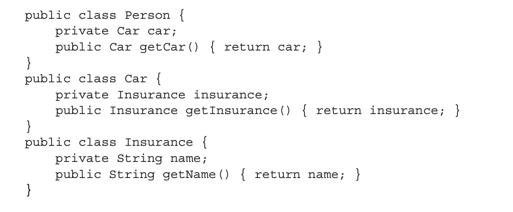
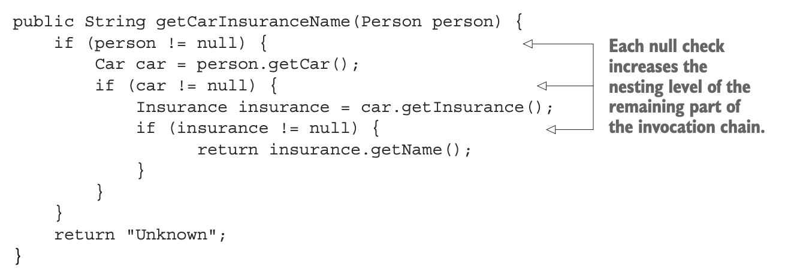
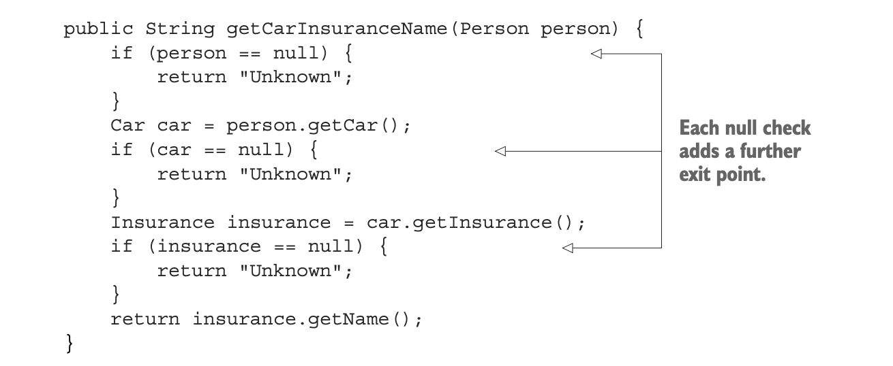
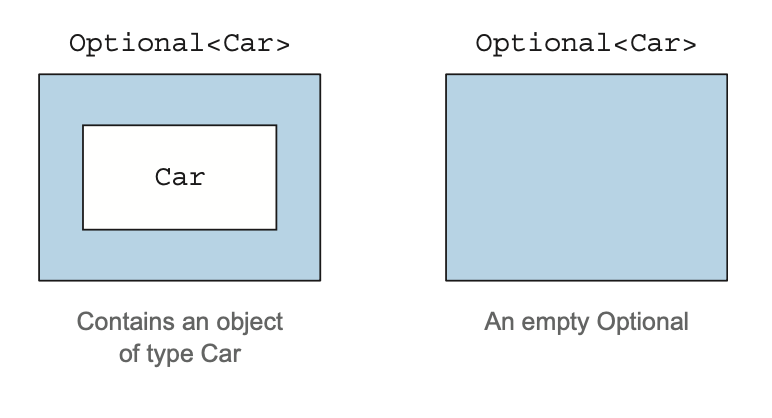
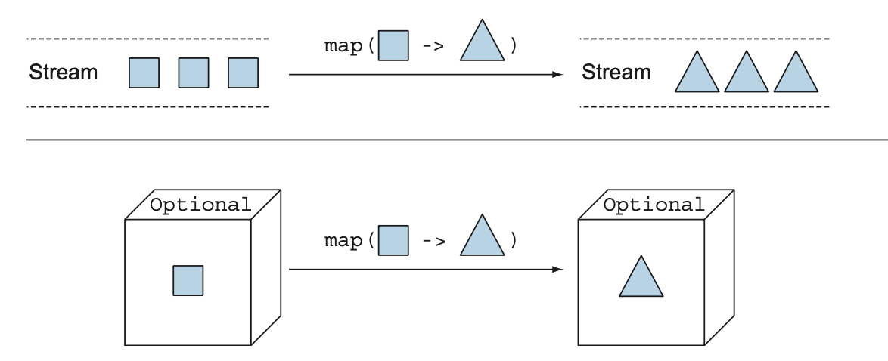
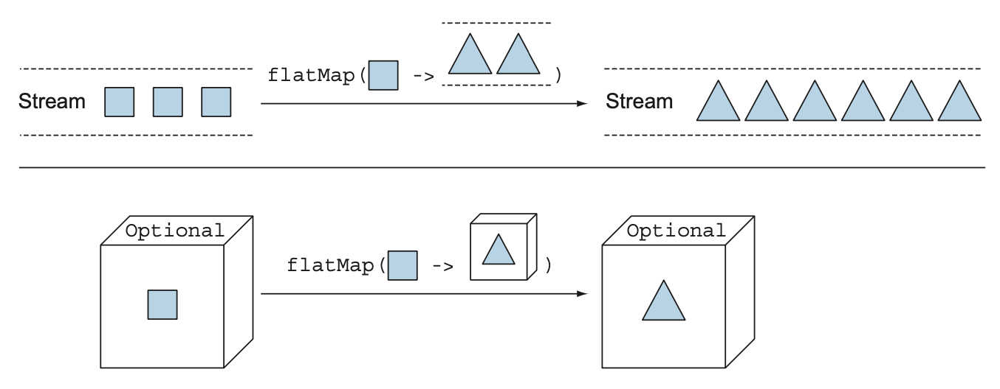
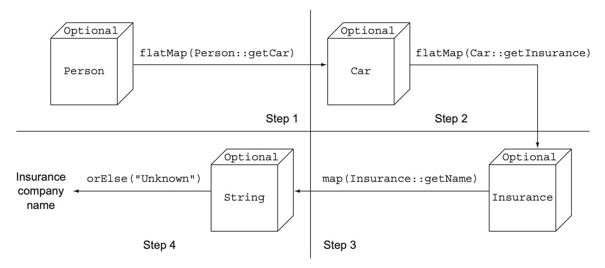
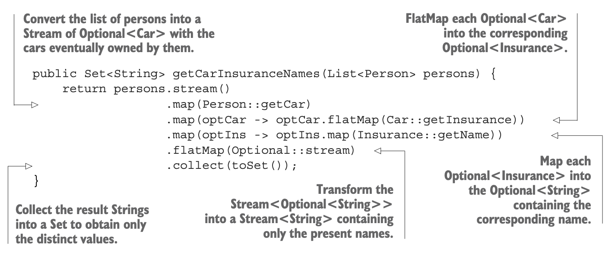
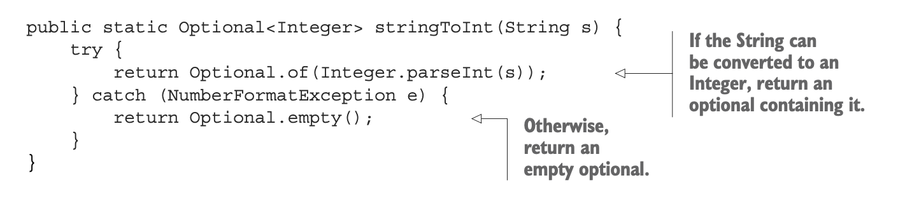

## Using Optional as a better alternative to null

- [How do you model the absence of a value](#How-do-you-model-the-absence-of-a-value)
- [Reducing NullPointerExceptions with defensive checking](#Reducing-NullPointerExceptions-with-defensive-checking)
- [Problems with null](#Problems-with-null)

- [Introducing the Optional class](#introducing-the-Optional-class)
- [Creating Optional objects](#Creating-Optional-objects)
- [Extracting and transforming values from Optionals with map
  ](#Extracting-and-transforming-values-from-Optionals-with-map)
- [Manipulating a stream of optionals
  ](#Manipulating-a-stream-of-optionals)
- [Default actions and unwrapping an Optional](#Default-actions-and-unwrapping-an-Optional)
- [Combining two Optionals](#Combining-two-Optionals)
- [Practical examples of using Optional](#Practical-examples-of-using-Optional)
- [Exceptions vs Optional](#Exceptions-vs-Optional)

---

### How do you model the absence of a value

- Nested object structure for a person who owns a car and has car insurance in the following listing.



```java
public String getCarInsuranceName(Person person){
    return person.getCar().getInsurance().getName();
}
```

**Things to Consider**

- Many people don't own car.
- the result of calling the method getCart?
- What is person was null?
- what is the method getInsurance() return null too?

---

### Reducing NullPointerExceptions with defensive checking

- add null checks where necessary

First Attempt



- #### poorly and compromises readability,

Second Attempt



- every time you meet a null variable, you return the string "Unknown".

---

### Problems with null

- the use of null references in Java causes both theoreti- cal and practical problems:

- It’s a source of error.

  - NullPointerException is by far the most common exception in Java.

- It bloats your code

  - It worsens readability with null checks that are often deeply nested.

- It’s meaningless.
  - It doesn’t have any semantic meaning, and in particular, it represents
  - the wrong way to model the absence of a value in a statically typed language.
- It breaks Java philosophy.
  - Java always hides pointers from developers except in one case: the null pointer.
- It creates a hole in the type system.
  - null carries no type or other information,
  - so it can be assigned to any reference type.
  - This situation is a problem because when null is propagated to another part of the system,
  - you have no idea what that null was initially supposed to be.

---

### Introducing the Optional class

- The class encapsulates an optional value.
- If you know that a person may not have a car,
- for example:
  - the car variable inside the Person class shouldn’t be declared type Car and assigned to a null reference when the person doesn’t own a car;
  - instead, it should be type Optional<Car>,



- When a value is present, the Optional class wraps it.

- the absence of a value is modeled with an empty optional returned by the method Optional.empty.

#### using the Optional class

```java
public class Insurance {
	private String name;
	public String getName() {
		return name;
	}
}
```

```java
public class Car {
	private Optional<Insurance> insurance;

	public Optional<Insurance> getInsurance(){
		return insurance;
	}
}
```

```java
public class Person {
	private Optional<Car> car;
	public Optional<Car> getCar(){
		return car;
	}
}
```

---

### Creating Optional objects

- You can create them in several ways.

- ### Empty Optional
  ```java
   Optional<Car> optCar = Optional.empty();
  ```
- #### OPTIONAL FROM A NON-NULL VALUE
  ```java
  Optional<Car> optCar = Optional.of(car);
  ```
- ### OPTIONAL FROM NULL
  ```java
  Optional<Car> optCar = Optional.ofNullable(car);
  ```

---

### Extracting and transforming values from Optionals with map

- extract the name from an insurance company,

```java
Optional<Insurance> optInsurance = Optional.ofNullable(insurance);
Optional<String> name = optInsurance.map(Insurance::getName);
```



---

Rewrite the following the code using Optionals.

```java
public String getCarInsuranceName(Person person) {
            return person.getCar().getInsurance().getName();
}
```

### this code doesn’t compile. Why?

```java
Optional<Person> optPerson = Optional.of(person);
Optional<String> name =
    optPerson.map(Person::getCar)
             .map(Car::getInsurance)
             .map(Insurance::getName);
```

- The variable optPerson is of type Optional<Person>,

- But getCar returns an object of type Optional<Car>

- which means that the result of the map operation is an object of type Optional<Optional<Car>>.

- the call to getInsurance is invalid because
  the outermost optional contains as its value another optional, which of course doesn’t support the getInsurance method.

#### Chaining Optional objects with flatMap

- With streams, the flatMap method takes a function as an argument and returns another stream.

- This function is applied to each element of a stream,

- resulting in a stream of streams.

- But flatMap has the effect of replacing each generated stream with the contents of that stream.

- In other words, all the separate streams that are generated by the function get amalgamated

- or flattened into a single stream.

- What you want here is something similar,

- but you want to flatten a two-level optional into one.



#### Finding A CAR’S insurance Company name with OPTIONALS

```java
public String getCarInsurance(Optional<Person> person){
	return person
		.flatMap(Person::getCar)
		.flatMap(Car::getInsurance)
		.map(Insurance::getName)
		.orElse("Unknow");
}
```

---

### illustrates this pipeline of operations.



- Begin with the optional that wraps the Person and invokes flat- Map(Person::getCar) on it.

- Step 1:

  - a Function is applied to the Person

  - inside the optional to transform it.

- In this case,

  - the Function is expressed with a method reference
  - invoking the method getCar on that Person.

- Because that method returns an Optional<Car>,

  - the Person inside the optional is transformed

  - into an instance of that type,

  - resulting in a two-level optional

  - that’s flattened as part of the flatMap operation.

- From a theoretical point of view,

  - this flattening operation as the operation that combines two nested optionals,

  - resulting in an empty optional if at least one of them is empty.

  - What happens in reality is that if you invoke flatMap on an empty optional, nothing is changed,

  - and the empty optional is returned as is.

- Conversely,

  - if the optional wraps a Person,

  - the Function passed to the flatMap method is applied to that Person.

  - Because the value produced by that Function application is already an optional,

  - the flatMap method can return it as is.

- Step 2 :

  - transforming the Optional<Car> into an Optional<Insurance>.

- Step 3 :

  - turns the Optional<Insurance> into an Optional <String>:

  - because the Insurance.getName() method returns a String.

---

### Using optionals in a domain model and why they’re not serializable

- the Optional class wasn’t intended for use as a field type,

- it doesn’t imple- ment the Serializable interface.

- using Optionals in your domain model could break applications with tools or frameworks that require a serializable model to work.

- At least provide a method allowing access to any possibly missing value as an optional,
- as in the following example:

```java
public class Person {
  private Car car;
  public Optional<Car> getCarAsOptional() {
     return Optional.ofNullable(car);
  }
}
```

---

### Manipulating a stream of optionals

- The Optional’s stream() method,

  - allows you to convert an Optional with a value to a Stream containing only that value or

  - an empty Optional to an equally empty Stream.

- when you have a Stream of Optional

- and need to transform it into another Stream containing only the values present

- in the nonempty Optional of the original Stream.

example

- return a Set<String> containing all the distinct names of the insurance companies used by the people in that list who own a car.



- each element is also wrapped into an Optional.

- return an Optional<Car> instead of a simple Car.

- The first map transformation, you obtain a Stream<Optional<Car>>.

- the two subsequent maps allow you to transform each Optional<Car> into an Optional<Insurance> and then each of them into an Optional<String>

- obtain a Stream<Optional<String>>

- Optionals allows you to perform these operations in a completely null-safe way even in case of missing values,

---

### Default actions and unwrapping an Optional

The Optional class provides several instance methods to read the value contained by an Optional instance:

- **get()** :

  - It returns the wrapped value if one is present and throws a NoSuchElementException otherwise.

- **orElse(T other)**

  - it allows you to provide a default value when the optional doesn’t contain a value.

- **orElseGet(Supplier<? extends T> other)**

  - is the lazy counterpart of the orElse method,

  - invoked only if the optional contains no value.

  - You should use this method when the default value is time-consuming to create (to gain efficiency) or

  - you want the supplier to be invoked only if the optional is
    empty (when using orElseGet is vital).

- **or(Supplier<? extends Optional<? extends T>> supplier)**

  - is similar to the orElseGet method, but

  - it doesn’t unwrap the value inside the Optional, if present.

- **orElseThrow(Supplier<? extends X> exceptionSupplier)**

  - is similar to the get method in that it throws an exception when the optional is empty,

  - but it allows you to choose the type of exception that you want to throw.

- **ifPresent(Consumer<?superT>consumer)**

  - lets you execute the action given as argument if a value is present; otherwise, no action is taken.

Java 9 introduced an additional instance method:

- **ifPresentOrElse(Consumer<?superT>action,RunnableemptyAction)**

  - This differs from ifPresent by taking a Runnable that gives an empty-based action to be executed when the Optional is empty.

---

### Combining two Optionals

- find the insurance company that offers the cheapest policy for that combination:

First attempt could be to implement this method as follows:

```java
public Optional<Insurance> nullSafeFindCheapestInsurance(
                                      Optional<Person> person, Optional<Car> car) {
    if (person.isPresent() && car.isPresent()) {
        return Optional.of(findCheapestInsurance(person.get(), car.get()));
    } else {
       return Optional.empty();
    }
}

```

---

### Filtering an optional

```java
public String getCarInsuranceName(Optional<Person> person, int minAge) {
    return person.filter(p -> p.getAge() >= minAge)
        .flatMap(Person::getCar)
        .flatMap(Car::getInsurance)
        .map(Insurance::getName)
        .orElse("Unknown");
}

```

---

### Practical examples of using Optional

- Wrapping a potentially null value in an Optional

#### Example

- The get method of a Map returns null as its value if it contains no mapping for the requested key,

- a Map<String, Object>, accessing the value indexed by key with

```java
Object value = map.get("key");
```

- use the method Optional.ofNullable :

- to safely transform a value that could be null into an optional.

```java
  Optional<Object> value = Optional.ofNullable(map.get("key"));
```

---

### Exceptions vs Optional

- the conversion of String into an int provided by
- the Integer.parseInt(String) static method.
- if the String doesn’t contain a parseable integer, this method throws a NumberFormat- Exception.


